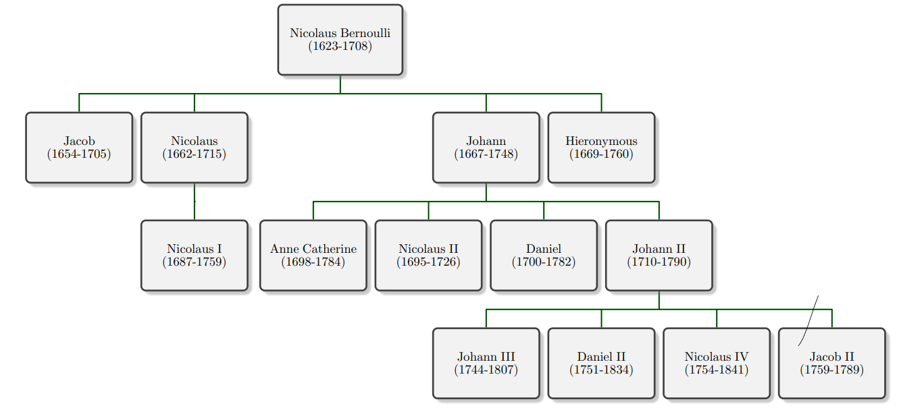

# Wykład 01: 02.03.22 - Matematyka na przełomie XVII i XVIII w., spojrzenie z dystansu

Tagi: wiek XVII, bernoulli, spor o matematyke, de l'hospital

## Wstęp

W trakcie XVII rozpoczął się dynamiczny rozwój matematyki. Porównać go można z przełomem koperńikańskim. Trwa ośiwecenie. Rozwijają się:

- geometria analityczna (poziom "ponadlicealny");
- rachunek różniczkowy;
- rachunek całkowy;
- statystyka;

## Ważne posataci i zasługi

- Isaac Newton: rachunek całkowy;
- Gottfried W. Leibniz;
- Michel Rolle: twierdzenie Rolle'a;
- Guillaume de l'Hospital: reguła de l'Hospitala;
- Abraham de Moivre: wzory de Moivre'a;
- Brook Taylor: szeregi Taylora;
- Christian Goldbach: hipoteza Goldbacha;
- James Stirling: wzór Stirlinga przybliżający silnię;
- Gabriel Cramer: wzory Cramer'a do rozwiązywaniarównań liniowych;

## W skrócie

- Pojawia się wiele uczelni inżynierskich oraz wojskowych.
- Migracja z powodu prześladowań na tle religijnym.
- Wielu monarchów i magnatów oferuje uczonym pozycje na swoich dworach.

## Co się dzieje i gdzie?

- Wielka Brytania
  - Następcy Wallisa i Newtona;
  - Uniwersytety Oxford, Cambridge, Edynburg, Glasgow;
  - Matematyka stosowana;
  - Zwalnia na koniec XVII w.;
  - Stirling, de Moivre, Taylor;

- Francja
  - Prężnie rozwija się w trakcie Oświecenia;
  - Akademia Francuska;
  - Uczniowie Kartezjusza;
  - Roll, de l'Hospital;
  - Zaskakująco dużo matematyków "z ludu". Wiedza stanowi drogę do pozycji społecznej;

- Niemcy
  - Po wojnie 30-letniej nic ciekawego się nie dzieje;
  - Trochę rachowania w Hamburgu, trochę astronomii w Norymberdze;

- Szwajcaria
  - Klan Bernoullich, Cramer;
  - Bazylea, Genewa;
  - Neutralność polityczna i światopoglądowa sprzyja rozwojowi nauki;

- Poza tym
  - W Skandynawii nic się nie dzieje;
  - We włoszech: uczniowie Galileusza w Padwie (ale nie dużo)

## Działy matematyki

- (Nowość!) Rachunek różniczkowy i całkowy;
  - Newton i Leibniz;
- Rachunek wariacyjny, rachunek prawdopodobieństwa, statystyka;
  - Bernoulli(todo: który), Newton, de Moivre;
- Geometria analityczna;
- Algebra jest troszkę w tyle;
  - kłopoty z liczbami ujemnymi i abstrakcją;

## Klan Bernoullich

### Nicholaus Bernoulli (1623 - 1708)

Jego ojciec (Jakub Bernoulli) ciekł z Niderlandów do Bazylei w 1622. Nicholaus odziedziczył biznes handlowy po ojcu. Ożenił się z córką bankiera (12 dzieci). Był radnym w Bazylei.

### Hieronymous Bernoulli (1669-1760)

Odziedziczył biznes po Nicholausie.

### Nicholaus (zwany starszym) Bernoulli (1662 - 1715)

Malarz portretowy, radny Bazylei.

### Jacob Bernoulli (1654 - 1704)

Studiował w Bazylei języki, filozofię, teologię. Bazylea nie była jeszcze dobrym miejscem do studiowania nauk ścisłych.

Wyjechał po studiach do Genewy. Pracował jako prywatny nauczyciel. W końcu wylądował w Paryżu, gdzie poznał dzieła Kartezjusza. Potem Holandia, Anglia (Royal Society, Hook). Wtedy też zaczął publikować prace (teoria na temat powstawania komet, badanie masy eteru).

Wrócił do Bazylei, ożenił się i objął katedrę matematyki (podobno źle zarabiał).
Osiągnięcia:

- Ars Conjectandi - Sztuka Przewidywania(wydane 1713);
  - Wartość oczekiwana;
  - Rozkład dwumianowy;
  - Prawo wielkich liczb;
- Bada wartość procentu składanego, szeregi nieskończone (suma odwrotności kwadratów liczb naturalnych jest znana jako problem Bazylejski);
- Jako pierwszy zauważył stałą *e*;
- Problem izochromy;
- Rachunek prawdopodobieństwa (rozkład Bernoulliego);
- Prawo wielkich liczb;

### Johann Bernoulli (1667 - 1748)

Studiuje medycynę na uniwersytecie w Bazylei. Jedzie do Genewy i Paryża, gdzie wykłada swoją interpretację prac Leibniza. Spotyka de l'Hospitala, który zostaje jego (todo: słowo na filantropię w ośiweceniu). Wraca na jakiś czas do Bazylei, potem wyjeżdża na jakiś czas do Groningen.

Osiągnięcia:

- Problem krzywej łańcuchowej;
- Na podstawie jego wykładów de l'Hospital wydał pierwszy duży podręcznik do rachunku różniczkowego i całkowego;
- Badał zagadnienie brachistochromy, zagadnienie izoperymetryczne;
- *Hydraulica*; Podstawy hydrodynamiki;

### Nicholaus I Bernouli (1687 - 1759)

Doktorat w Bazylei z zastosowań prawdopodobieństwa w sądownictwie. Wyjechał na jakiś czas do Padwy, ale po kilku latach wrócił do Bazylei, gdzie objął katedrę logiki. Mało publikował, dużo korespondował.

Osiągnięcia:

- Rozwiązał problem Bazylejski (chwilę po Eulerze, ale za to elegancko i prosto);
- Skompletował prace Jacob'a Bernoulli'ego i wydał je w *Opera Omnia*;

### Nicholaus II Bernouli (1695 - 1726) oraz Daniel Bernouli (1700 - 1782)

Podróżowali po Francji, dostali obaj zaproszenie do Petersburgu do Akademi Carskiej.

Osiągnięcia Daniela (bo Nicholaus II zmarł tuż po przyjeździe do Petersurbu):

- Metoda pomiaru ciśnienia krwi;
- Klepsydry żyroskopowe;
- Współpraca z Eulerem;
- Hydrodynamica 1738; prawo Bernoulliego;
- Wykłada biologię, fizykę;
- 10 razy zdobył nagrodę akademii Paryskiej;
- Kinetyczna teoria gazów;
- Badanie elastyczności;
- Pierwszy zaczął stosować statystykę do zagadnień demograficznych;

### Ciekawostki

Pierrer Currie był potomkiem Bernoullich.

### Guillaume Francois de l'Hospital (1631-1704)

Francuski arystokrata. Płacił stałą pensję Johann'owi Bernoullie'mu za wyłącznośc do jego prac naukowych.

Na podstawie tych prac wydał w 1696 *Analiza nieskończenie małych*.
Był to pierwszy podręcznik rachunku różniczkowego i całkowego.
W dodatku napisany jasno i klarownie.

Po jego śmierci Johann Bernoulli zaczął (dość nieporadnie) zgłaszać pretensje do swoich wyników.

### Michel Rolle (1652 - 1719)

Przeciwnik rachunku różniczkowego i całkowego. Jego kontrprzykłady pogłębiły zrozumienie i przyspieszyły rozwój tychże działów matematyki.

Osiągnięcia:

- *Traite d'Algebre* 1690; pierwsze pojawienie algorytmu eliminacji Gausse'a;
- *O nowym systemie nieskończoności* 1703; Krytyka Leibniza;

### Abraham de Moivre (1667 - 1754)

Po studiach we Francji po odwołaniu edyktu nantejskiego trafił do więzienia na 2-3 lata. Po odzyskaniu wolności wyjechał do Londynu, gdzie zaprzyjaźnił się z Newtonem. Nie mógł znaleźć stałego zatrudnienia na żadnej uczelni. Utrzymywał się z prywatnych lekcji.

Dokonania:

- Korekta optyki Newtona;
- Newton zapytany o jakieś szczegóły z *Principia*:
"*Idźcie do pana de Moivre'a, on to umie lepiej ode mnie.*"
- *The Doctrine of Chances* 1718; Podwaliny statystyki i rachunku prawdopodobieństwa;

### Brook Taylor (1685 - 1731)

Sekretarz Royal Society po Newtonie.

Dokonania:

- *Methodus Incrementorum Directa
& Inversa*; wzór Taylora

### James Stirling (1692 - 1770)

todo: (?) nic o nim nie powiedzieli

### Christian Goldbach (1690 - 1764)

Pochodził z Krulewca. Korespondował z Leibnizem, Bernoullimi i Eulerem. Był nauczycielem cara Piotra II.

Dokonania:

- Teoria liczb;
- Szeregi liczbowe;
- Hipoteza Goldbacha;

### Gabriel Cramer (1704 - 1752)

Bardzo ceniony uczeń Johann'a Bernoulli'ego.

Dokonania:

- Wzory Cramera;
- Opracował i wydał *Opera Omnia* Johann'a Berrnouli'ego

### Georges-Louis Levlerc de Buffon (1707 - 1788)

Przyrodnik, intendent we Francuskich ogrodach królewskich, członek Akademii Francuskiej.

Osiągnięcia:

- Autor zadania o igle ze statystyki; pozwala eksperymentalnie wyznaczyć wartość liczby $\pi$;

## "Spór o nieskończenie małe", czyli jak matematyka przestała być dobrze uporządkowaną nauką

Trudno to ładniej napisać niż jest w cytatach na prezentacji. W skrócie:

Pprzejścia graniczne były zupełnie nieuporządkowane. Symbol dx czasem był równy 0, czasem nie był. Słabe definicje prowadziły do słabych dowodów i fałszywych twierdzeń.

Wyniknął z tego spór miedzy matematykami o to czy wielkości nieskończone i nieskończenie małe istnieją czy nie.

Leibniz w tym sporze zajmował dość neutralną pozycję. Niemal musnął definicje typu $\epsilon$, $\delta$ (które w wykonaniu Weiertrass'a zformalizowały analize matematyczną).

Rolle był zdecydowanym przeciwnikime rachunku różniczkowego. Wymyślając kontrprzykłady znacznie przyczynił się do jego zrozumienia i rozwoju.

Spór o nieskończenie małe jest przykładem tego, że przełomy w matematyce są często przyjmowane z trudem.

## Podsumowanie

XVII wiek to moment, w którym zaczyna się współczesna matematyka.
