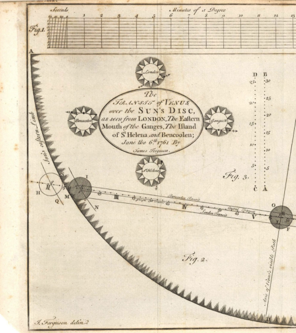
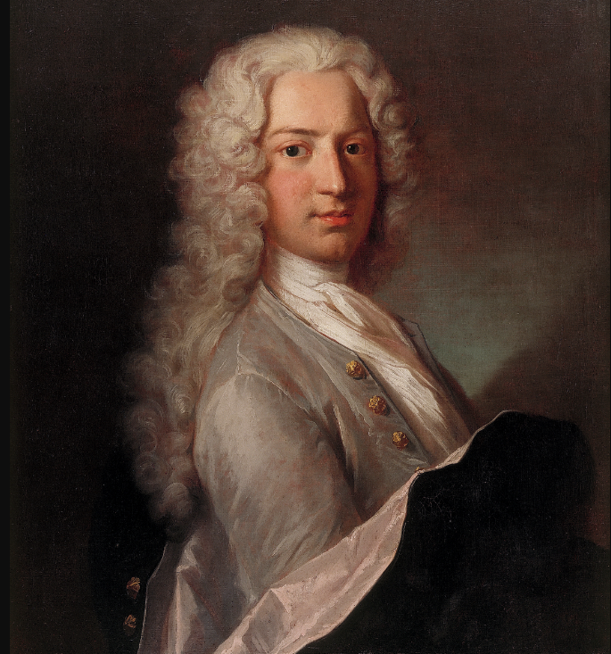
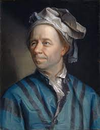
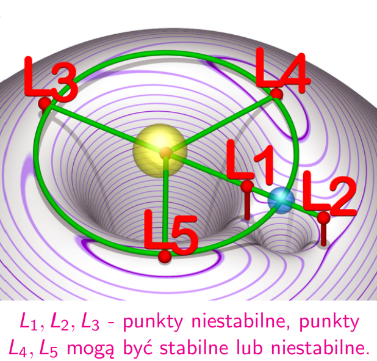

# Wykład 02: 09.03.22-Euler i inni. Analiza i mechanika w XVIII wieku

## Wiek XVII. Rewolucja naukowa

Współpraca Akademii Naukowych: Paryż, Londyn, Berlin, Petersburg, Sztokholm, ...

### Międzynarodowy projekt zbadania kształtu ziemi (Francja, Hiszpania)

- Wyprawa do Laponii 1736-37, Pierre Louis Maupertuis
- Wyprawado Ekwadoru, 1735-44, Charles Marie de La Condamine

Celem wypraw było określenie kształtu ziemi poprzez porównanier długości południków.

### Międzynarodowy projekt zbadania odległości Słońca od Ziemi
  
Odległość tą da się zbadać, poprzez porównanie czasu przejścia Wenus przez tarczę słoneczną, obserwowanego z różnych miejsc na ziemi. Do przedsięwzięcia rękę przyłożyło setki naukowców z różnych krajów.

Warto zwrócić uwagę, że kiedy Anglia była w stanie wojny z Francją ich ekspedycje naukowe prowadziły wspólny projekt.

- Sponsorzy:

  Król Ludwik XV, królowie Jerzy II i III, caryca Katarzyna Wielka, królowa Luiza Ulryka, król Carlos III, ...

  Podobno Ludwik XV był wielce zainteresowany nauką.

- Badacze:

  Benjamin Franklin, Michał Łomonosow, James Cook, ..., setki obserwatorów

Pierwsza próba w 1761 zakończyła się niepowodzeniem.

Druga próba w 1769 zakończyła się sukcesem. (Wg wykładu kilkaset tysięcy kilometrów błędu. Wg wikipedii ~1.2 mln km błędu. Około 0.8%.)

Wielu naukowców w ramach tych wypraw sporządziło dokładne jak na tamte czasy mapy ziemi.

## Rozwój matematyki

- Analiza matematyczna;
- Równania różniczkowe zwyczajne; Mechanika klasyczna, $m\ddot{x}=F$ (ten wzór pierwszy raz widziany u Eulera);
- Równania różniczkowe cząstkowe; Rozchodzenie się ciepła;
- Mechanika płynów; Równania Eulera;
- Rachunek wariacyjny; Mechanika Lagrange'a;
- Uzasadnienie podstaw rahunku różniczkowego;

## Daniel Bernoulli

- Groningen, 1700

  - Studia medyczne w Wenecji;
  - Matematyka jako dodatek;

Przemieścił się do Petersburgu ponieważ lepiej tam płacili.

- Petersburg, 1725 - 1733

  - Prowadził wykłady min. z fizyki;
  - Współpracował z Eulerem na wydziale matematyki;
  - Poza tym hydrodynamika, prawdopodobieństwo;

Wyjechał z Rosji z powodów bezpieczeństwa. (Za "nie takie jak trzeba" opinie łatwo było stracić głowę.)

- Bazylea, 1734

  - Dalsza współpraca z Eulerem;
  - *Hydrodynamica* 1738; Metoda pomiaru ciśnienia płynu;
  - $\frac{v^2}2+\frac{p}{\rho}+gz = const$; równanie Bernoulliego
  - Poza tym akustyka, astronomia, nautyka, magnetyzm;

### Leonard Euler (1707 - 1783)

Jest odpowiedzialny za 3/4 matematyki XVIII wieku. Był najbardziej płodnym matematykiem wszechczasów.

Zajmował się: astronomią, teorią liczb, topologią, hydrodynamiką, analizą matematyczną.

#### Biografia

- Bazylea, 17007 - 1727
  - Nauka u Johanna Bernoulli’ego

W 1725 został zaproszony do Petersburgu.

- Petersburg, 1727–1741
  - Wydział Matematyki
  - Współpraca z Danielem Bernoulli

Wyjazd z Petersburgu z powodów bezpieczeństwa.

- Berlin, 1746–1766
  - Fryderyk Wielki
  - Od 1735 pogorszenie się wzroku, ”cyklop”. Później oślepł całkowicie. Większość pracy związanej z matematyką już jako osoba niewidoma.

Został poniekąt wyrzucony z Berlina, ponieważ był zbyt mało liberalny na tle religijno-towarzyskim dla Fryderyka Wielkiego. Dosatł zaproszenie od Katarzyny Wielkiej.

- Petersburg, 1766–1783
  - Katarzyna Wielka

### Matematyka Eulerowska

- "*Podążaj za formułami, a one doprowadzą cię do prawdy*" (L. Euler)

  Euler zazwyczaj nie zastanawiał się czy jakąś operację można wykonać (np. operacje na seregach nieskończonych), tylko wykonywał ją i patrzył gdzie go doprowadzi.

  Należy być śmiałym, brać pomysły z fizyki, wykonywać obliczenia, a potem uzasadniać dlaczego wyniki mają sens.

- Przy rozwinięć funkcji trygonometrycznych w szereg pokazał $\sum_{n=1}^\infty\frac1{n^2}=\frac{\pi^2}{6}$

  Wynik sprawdził ręcznie obliczając sumę częściową szeregu.
- Pokazał $\sum_{n=1}^\infty n = -\frac1{12}$

  Wynik ten ma zastosowania w kwantowej teorii pola. Jest potwierdzony eksperymentalnie.

Gdyby grecy wystaszyli się liczb niewymiernych (np. przekątnej kwadratu), ale nie chcieliby o nich słyszeć matematyka doznałaby zastoju.

Analogicznie Euler nie wystraszył się swoich wyników.

(To z wykładu cytat.)

### Słynne monografie Eulera z analizy matematycznej

- "*Wstęp do Analizy Nieskończoności*", 1747;

  - zdefiniowała współczesny język analizy;
  - definicja funkcji, szeregu, ...;
  - liczby $\pi$, $e$;
  - definicje $\cos$ i $\sin$;
  - wzór Eulera $\cos x + i\sin x = e^{ix}$;

- "*Rachunek Różniczkowy*", 1755;
- "*Rachunek Całkowy*", 1770;

### Euler dodatki

- $e^{ix} = \cos x + i\sin x$

  Dla $x = \pi$:  
  
  $e^{i\pi}+1=0$

  Jest to jeden z popularniejszych wzorów obok:

  $E = mc^2$ i $(i{\partial} - m)\psi = 0$ ($\partial$ powinno być kreślone ale .md nie umie)

- Równania Eulera płynu o stałej gęstości $\rho$ stanowią relację pomiędzy działającą siłą f, prędkością u i ciśnieniem płynu p.

  $\frac{\partial u}{\partial t} + (u\cdot \triangledown u) = -\frac1\rho\triangledown p+f$ (lewa strona to przyśpieszenie, prawa to siła dzielona przez masę)

  $\text{div }u = 0$ (To oznacza, że $\rho = const$)

### Joseph Louis Lagrange (1736 - 1813)

#### Biografia

- Turyn, 1736-1766
  - Towarzystwo naukowe;
- Berlin, 1766-1787
  - Fryderyk Wielki;
  - "*M´ecanique analytique*", astronomia;
- Paryż 1787-1813
  - Rewolucja francuska, 1789-1799 (nie mieszał się w politykę, więc uniknął gilotyny)
  - system metryczny;
  - Wkład w prawie każdą dziedzinę matematyki, mechanika, astronomia;

Cytat z wykładu który zdecydowałem się tutaj zamieścić:

*Imperia piszą historię, ale dzisiaj pisze sie coraz więcej prawdy.*

### "*M´ecanique analytique*", 1788

- Mechanika wyrażona czysto
analitycznie jako elegancka
teoria;
- Zawiera mechanikę Newtona;
- Nie ma żadnego wykresu;
- Zasada najmniejszego
działania, L = T − U (L = energia kinetyczna - energia potencjalna)

- Równanie Lagrange'a

  $\frac d{dt}\frac{\partial L}{\partial \dot q} - \frac{\partial L}{\partial q} = 0$

  jest uniwersalne w fizyce współczesnej.

  Zastosowanie min. w teorii kwantów.

Od mechaniki Lagrange'a pochodzi mechanika Hamilton'a, która jest jeszcze bardziej elegancka.

### Przykłady zagadnień rozpatrywanych przez Lagrange'a

#### Problem trzech ciał. Punkt Lagrange'a

W przestrzeni znajdują się 3 ciała. Znamy ich masy i początkowe prędkości. Należy obliczyć trajektorie.

Otóż zazwyczaj się nie da.

Jeśli jedno z ciał ma pomijalną masę (np. satelita w układzie ziemia-słońce) to problem da się rozwiązać.

- W punkcie $L_1$ znajduje się obserwatorium SOHO.
  
  Badanie:
  - Wewnętrznej struktury Słońca;
  - Zjawisk na powierzchni słońca;
  - Wiatru słonecznego, jego wpływu na Ziemię;

- W punkcie $L_2$ zaparkował kilka miesięcy temu Kosmiczy Teleskop Jamesa Webba.
  - Obserwacje w podczerwieni;
  - Uzupełnienie teleskopu Hubble’a;
  - Badanie powstawania gwiazd i systemów planetarnych;
  - Badanie formowania się i ewolucji galaktyk;
  - Obserwacje pierwszych gwiazd powstałych po Wielkim Wybuchu;
