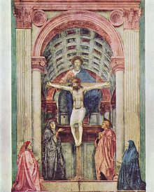
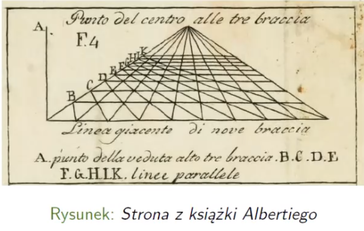
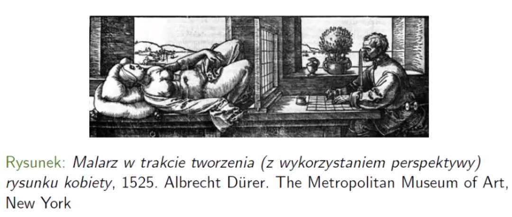
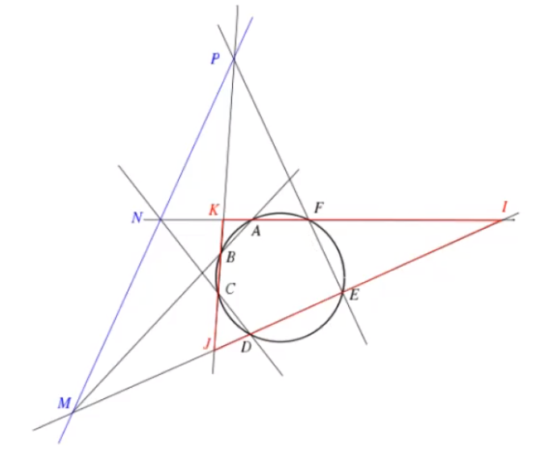
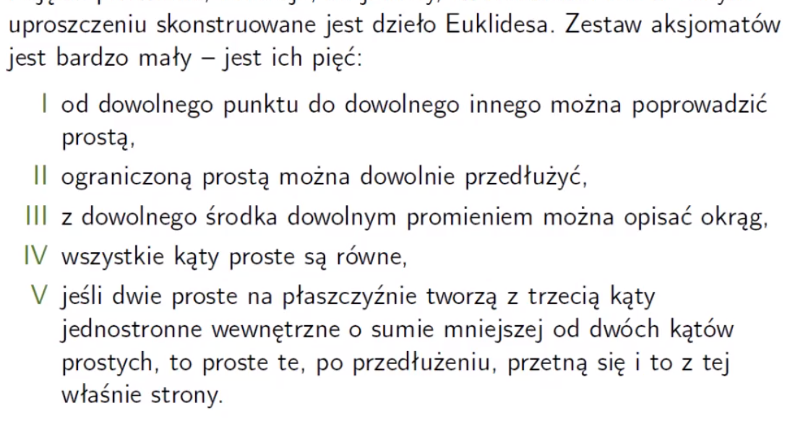

# Wykład 04: 24.03.22 Aksjomatyzacja geometrii XVII - XIX w. (Danuta Ciesielska)

Czy jest tylko jeden możliwy opis (mierzenie) świata? Czy jest tylko jedna geometria? Wcześniej wierzono, że istnieje tylko geometria Euklidesowa. Porzadek prawie chronologiczny.

- geometria Euklidesowa
- geometria sferyczna - astronomia
- geometria wykreślna
- geometria rzutowa
- geometria nieeuklidesowa (hiperboliczna)
- geometria różniczkowa 
- geometria algebraiczna

## Geometria rzutowa
Początki to badania nad perspektywą malarską. Ookło 1420 Filippo Brunelleschi (1377-1446) namalował pierwszy obraz, w którym widać perspektywę malarską:

Podstawy nauki (rzemieślniczej) malarskiej perspektywie dał **Leon Battista Alberti**(1404-1472) w książce o zasadach malarskich (*Della pittura*), zaprezentował tam metodę z użyciem ramy i siatki, ułatwiająca zadanie przekształcenia widzianego obiektu przestrzennego na płaską powierzchnię.

Albertiemu zawdzięczamiy podstawowe zasady perspektywy:
- linie proste pozostają prostymi
- linie równoległe albo pozostają takimi, albo przecinają się w jednym (niedostępnym, znikającym) punkcie.

Alberti jako pierwszy zauważył, że proponowane przez niego przekształcenie nie zachowuje ani kątów, ani **proporcji** (w przeciwieństwie do wcześniejszych malarzy). Dlatego ta geometria jest inna niż euklidesowa.

Metodę zaproponowaną przez Albertiego rozwinął **Albrecht Durer**(471-1528).

Zaburzenie proporcji nie zgadzało się z Elementami Euklidesa.

Do rozwoju przyczynili się kolejni artyści 
-**Leonardo da Vinci**:  pierwszy anamorficzny rysunek (Codex Atlanticus), anamorficzny czyli zniekształcony za pomocą odpowietniego rzutowania
-**Niceron** krzesło Nicerona, koncepcja rzutu (projekcji), ogólniejsze niż perspektywa.

Koncepcja geometrii opartej na koncepcji rzutu nie była spójna z panującą koncepcją geometrii Euklidesowej.

Pierwsze teoretycznie podstawy dał **Girard Desargues** (architekt) "Pierwszy zarys badania zjawisk, jakie zachodzą przy spotkaniu stożka z płaszczyzną", 1639. Rozważa w nim cień okręgu oświetlonego przez mocne punktowe źródło światła i zauważa, że może on przyjąć kształt krzywej stożkowej (elipsa, parabola, hiperbola). W dziele tym pojawiły się zasadnicze twierdzeniea geometrii rzutowej, w szczególności twierdzenie noszące dziś imię Desarguesa. *O dwóch trójkątach współkreślnych* (https://pl.wikipedia.org/wiki/Twierdzenie_Desargues%E2%80%99a).

### Johaness Kepler (1571-1630)
wprowadził pojęcie punktu w nieskończoności. Keplera inspirowaly badania **Witelona** (1230-1280) na temat optyki i anatomii widzenia. Postulat, że każde proste równoległe przecinają się w punkcie leżącym w  "nieskończoności". Desargues wykorzystał (ten fakt) do klasifikacji krzywych stożkowych (liczba punktów w nieskończoności, 2 - hiperbola, 1 - parabola, 0 - elipsa). 

Ideę tę widać u **Isaaa Newtona**, który w 1695 roku opracował klasyfikację krzywych stopnia trzeciego (*Lexicon Technicum* John Lexicon). Desargues i Kepler zauważyli, że punkt w nieskończoności domyka każðą linię do okręgu o nieskończonym promieniu - jak przetniemy prostą na pół to pozostaje w jednym kawałku. Była to pierwsza obserwacja, że topologiczny charakter "prostych rzutowych" jest odmienny od "prostych euklidesowych". Desargues wprowadził dla czterech współliniowych punktów $P, A, B, Q$ pojęcie dwustosunku $\frac{\frac{AQ}{BQ}}{\frac{AP}{BP}}$, jak się okazało kluczowe w tej geometrii.

Najważniejsze  jednak tw. **Blaisa Pascala** (1623-1662):

Jeżeli mamy krzywą stożkową (tutaj okrąg) i wpisany jest tam szcześciokąt, to punkty przecięcia odpowiednich boków (branych cyklicznie co 3), to są trzy punkty są współliniowe.
Inne osoby, które przyczyniły się do geometrii rzutowej:
- Jean-Victor Poncelet (1788-1867) - absolwent politechniki  francuskiej wcielony do wojska w wojnach Napoleońskich, więziony przez Rosjan, którzy zaproponowali mu, żeby wykładał geometrę wykreślną. Nie miał podręczników, więc wymyślił trochę inną geometrię: nie wykreślną, a rzutową.
- August Ferdinand Mobius (1790-1868) - wprowadzili układ współrzędnych: metoda barycentryczna. Jest to sposób opisania środka ciężkości trójkąta i gdzie punkty znajdują się w stosunku do tego środka.
- Julius Plucker (1801-1868) - badamy obiekty, a nie punkty, pierwsze zastosowania macierzy.
- Karl Georg Christian von Staudt (1798-1867) - rozwinął aksjomatykę, szczególnie zastosowań np. konstrukcja stycznej do okręgu z dowolnego punktu z wykorzystaniem samej linijki.
- Felix Klein (1849-1925) - rozwinął już geometrię z aksjomatyką i współrzędnymi, ale nie potrafiono mierzyć odległości.

Metryka Kleina: punkty $A,B$ leżące wewnątrz koła na cięciwie o końcach $P, Q$ są odległe o $\ln\frac{AQ\cdot BP}{AP\cdot BQ}$. Pokazuje ona, że odległość punktów mimo określenia nia czymś skończonym (cięciwa koła) może mieć wartość nieskończone.

## Geometria Euklidesowska
"Elementy" Euklides. Dzieło to stanowi wzór metody aksjomatycznej. 

Koncepcja prostej: to obiekt, który może być dowolnie rozszerzany, nie jest skończony. Elementy stały się podstawowym podręcznikiem geometrii (w szkołach). Jednak Rouse Ball twierdzi, że w ten sposób uzyskały nie zasłużoną sławę i narzuciły metodę. Jednak kontrowersje wzniecał ostatni, **aksjomat V**.

Walka z aksjomatem V:
- Najbardziej znanym komentatorem był **Proklos Diadochos** (410-485 n.e.) Był autorem *Komentarza do pierwszej księgi Euklidesa*. Dzieło to jest jednym z głównych źródeł, z których możemy wywnioskować o historii matematyki greckiej. Proklos uważał, że postulat V powinien być usunięty, gdyż jest twierdzeniem. Od Proklosa pochodzi "dowód" V postulatu. Zakłada w nim, że odległość między dwiema prostymi jest wielkokścią ograniczoną, co jest **równoważne** dowodzonemu aksjomatowi. Zatem proste nie przecinające się nie mogą się również dowolnie oddalać.

- **Thabit Ibn Qurra** (836-901) był autorem dwóch traktatów zawierających dowody V postulatu. W *Księdze o dowodzie znanego postulatu Euklidesa* opiera się on na założeniu, że jeśli dwie proste oddalają się jedna od drugiej z jednej strony, to muszą się zbliżać z przeciwnej. Bazuje on na metodzie dowodzowej wprowadzając pojęci ruchu. Zakłada jednak, że w takim ruchu wszystkie poruszające się punkty opisują linie proste, co jest równoważne V postulatowi.

- **Alhazen** (954 - 1039) *O rozwiązaniu wątpliwości w księdze Euklidesa 'Elementy'*, zakłada, że dwie przecinające proste nie mogą być równoległe do jednej prostej. **Hipoteza istnienia prostokąta**, jeśli ruch odbywa się po linii prostej to koniec odcinka prostopadłego do tej prostej, opisuje linię prostą, która jest równoodległa od danej. Ponownie, jak poprzednicy, dowodzi istnienia prostokąta. Zakłada prostokąt o 3 kątach prostych i rozważa trzy hipotezy, co do rozwartości czwartego kąta. Hipotezy kąta ostrego i rozwartego obala za pomocą V postulatu.

- **Omar Chajjam** poddał krytyce dowód Ibn al-Haithama. Stwierdził, że w geometrii niedopusczalne jest wprowadzenie ruchu. Sugerował zastąpienie aksjomatu równoległości innym aksjometem, jego zdaniem prostszym, ale ostatecznie równoważnym.
- **Nasir ad-Dina**
- Pierwsze "dowody" V postulatu w Europie podali **Leon Gersonides** oraz **Alfonso** (XV w.). Te same błędy
- **Christopher Schlussela**, też podał "dowód" opierając się na badaniach arabskich uczonych. Podał definicję prostej równoważną V. aksjomatowi.
- **Clavius** inne sformułowanie aksjomatu Euklidesa
Błogosławiony błąd, taki, który coś wnosi do nauki.
- **John Wallis** - aksjomat równoległości jest spełniony wtedy i tylko wtedy, gdy istnieją dwa podobne, ale nie przystające trójkąty.

## Początki geometrii nieeulkidesowej

**Girolamo Sacccherii (1667 - 1733)**
Włoski jezuita. Jak dopuścił możliwość, że dzieją się rzeczy nieprzewidywane, zastanowił się, do czego można dojść.  Badał na zasadzie *reductio ad absurdum*. Odkrył wiele twierdzeń geometrii nieuklidesowej (hiperbolicznej).

Opulikował pracę *Euklides oczyszczony z wczelkiej skazy...*. Przyjął 4 pierwsze postulaty i zamiast V. przyjął możliwość, że mogą te proste się nie przeciąć. Udowodnił 26 twierdzeń, postawił kilka tez. Udało się w czworokącie o 3. kątach prostych udowodnić, że czwarty kąt to nie jest kąt rozwarty. Udowodnił, że w zależności od tego, ile wynosi suma kątów w trójkącie jest >, < lub = od 180 stopni to mamy trzy różne geometrie.
- ">180" to sprzecznośc z tym, że prosta jest nieograniczona
- = 180 euklidesowa
- < 180, mogą się nieskończenie zbliżać, ale nie przeciąć.

 **Johan Heinrich Lambert (1728 - 1777)**, udowodnił twierdzenie, że nie istnieją figury podobne, ale nie przystające (w geom. nieeuklidesowej)

**Adrien-Marie Legendre (1752-1833)** wydał popularny podręcznik do geometrii w którym zawarł dowód V aksjomatu. W podręczniku znalazło się nieprawdziwe twierdzenie o sumie kątów w trójkącie, ale przez wiele lat ten podręcznik pozostawał w użyciu (12 wydań na 14 zawierało błąd). Ale udowodnił, że z aksjomatem Euklidesa jest równoważny inny oczywisty fakt.

**Ferdinand Karl Schweikart(1780-1857)** zniechęcony przez Gaussa zarzucił swoje badania.
**Franz Arnold Taurinus**, porzucił hipotezę kąta ostrego.

### Twórcy geometrii nieuklidesowej

**Farkas Bolyai** (1775 - 1856), z Rumunii, student uniwersytetu w Getyndze, gdzie poznał Gaussa. Rozważał niezależność V postulatu, konsultował swoje bania z Gaussem, ktory go zniechęcał. Wymyślił kolejną inną wersję aksjomatu Euklidesa.

**Nikołaj Iwanowicz Łobaczewski** (1792/93-1856) w 1826 opublikował pracę w którym wizja geometrii nieukl. jest spójna, wprowadza funkcję (Łobaczewskiego). Funkcja ta przyporządkowuje długośći odcinka miarę odpowiedniego kąta, zwanego kątem równoległości. Łobaczewski dowodzi, że kąt równoległości jest kątem ostrym oraz wartość funkcji wyraża się wzorem:
$$ \Pi(x) = \arcctg e^{\frac{x}{r}}$$
gdzie $r$ jest modułem promienia wprowadzonego przez Lamberta. Z własności tej funkcji wynika sporo własności tej geometrii. Praca stała się popularna później jak została wydana po niemiecku.

W podobnym czasie **Janos Bolyai**: ojciec pisał do syna: *Zaklinam cię, nie próbuj teorii równoległych,tracisz na to swój czas, a twierdzenia nie udowodnicie wszyscy razem*. Zdawał sobie sprawę, że nie dowodzi niczego, tylko tworzy nową geometrię. Praca została niezauważona, a Jonas przeżył załamanie nerwowe.

**Eugenio Beltrami** - twórca modeli geometrii nieeuklidesowej, na podstawie badań Bolayia-Łobaczewskiego. Inerpetacja geometrii na powierzchni o zakrzywieniu ujemnym jest poprawna (ale w pracy było brak obrazków).

**Felix Klein** - zaproponowany ma interpetację geometryczną. W pracy 1871 Klein pokaza, że geometrię nieeuklidesową pokazał jako gemoetrie rzutowe z odpowiednią metryką. Pokazał, że geometria Bolaya-Łobaczewskiego jest niesprzeczna.
Klein wyróżnia trzy geometrie: hiperboliczną, eliptyczną i paraboliczną. Kryterium podziału to charakter punktów prostej w nieskończoności. Te trzy gatunki geometrii to szczególne przypadki ogólnej metryki **Cayleya**.

## Aksjomatyzacja geometrii Euklidesowej
### David Hilbert (1862 - 1943)

Okazało się, że aksjomaty są niepełne. Opublikował w 1899 zestaw aksjomatów, podzielił je na pięć grup
- aksjomaty incydencji (8)- zależności, prosta przechodzi przez punkt itd.
- aksjomaty uporządkowania (4) - między dwoma punkty jest jedna prosta, dodany aksjomat Pascha)
- aksjomaty przystawania (5)
- aksjomat ciągłości (2, w tym aksjomat Archimedesa)
- aksjomaty równoległości (1)
Wzorzec geometrii Euklidesowej do dzisiaj.

**Karol Borsuk**, **Zofia Krygowska** - polski wkład.
Dzisiaj w szkole aksjomatyki się nie uczy, na studiach też się właściwe tych aksjomatów (około 20) też się nie uczy.

Aksjomatyka do wieku XVIII była wiodącą dziedziną metematyki, potem straciła prym na rzecz analizy i innych dziedzin.
