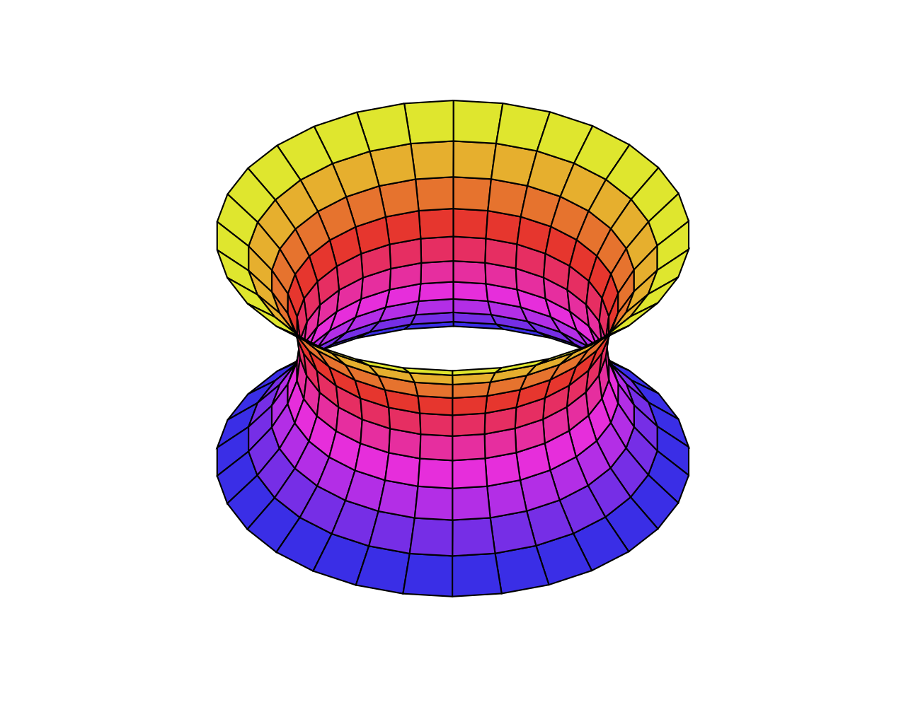
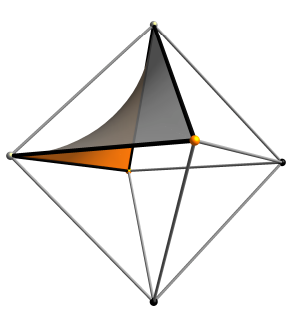

# Wykład 05: 30.03.22 - Geometria i nie tylko

Tagi: geometria, rozmaitość, krzywizna, powierzchnia minimalna, helikoida, katenoida, Gauss, Euler, Schwarz, Weierstrass, Riemann, Lie, Klein

## Zminay w geometrii na początku XVIII

Dzięki rozwojowi geometrii analitycznej i rachunku różniczkowego dostaliśmy możliwość badania nowych krzywych i powierzchni.

Stopniowo rozwijane były nowe działy matematyki, w tym rachunek wariacyjny oraz fizyka.

## Kluczowe pojęcia współczesnej geometrii

- Rozmaitość
    - ogólnie: obiekt, który w małej skali w każdym miejscu wygląda jak fragment przestrzeni euklidesowej, ewentualnie lekko zdeformowany (zakrzywiony, posklejany, itp.)
    - przykłady:
        - jednowymiarowe - krzywe gładkie, bez dziobków, zagięć, załamań i samoprzecięć - okrąg i prosta
        - dwuwymiarowe - wszelkie powierzchnie gładkie, bez ostrych szpiców, zagięć, kantów, itp, - sfera, torus, precel, butelka Kleina, wstęga Möbiusa
        - trójwymiarowe - np. sfera $S^3$, czyli zbiór punktów z $R^4$ taki, że $x^2+y^2+z^2+t^2=1$
- Krzywizna
    - "sposób pomiaru" zakrzywienia, np. jak bardzo odbiega od jakieś symetrycznego, eleganckiego modelu
    - określa lokalne i globalne cechy rozmaitości

## Powierzchnie minimalne

- Jaka powierzchnia obrotowa, rozpięta na dwóch okręgach, ma najmniejsze pole? Katenoida (Euler, 1744)
- Praca "Essai d'une nouvelle methode pour determiner les maxima et minima des formules integrales indefinies" (Lagrange, 1760)

## Katenoida

## Jak mierzyć krzywiznę?

1. Ustalić punkt i wbić tam pręt prostopadły do powierzchni E.
2. Ciąć powierzchnię płaszczyznami P prostopadłymi do E.
3. Mierzyć krzywiznę krzywych w przecięciu P i E (będzie to odwrotność promienia okręgu najbardziej przylegającego do danej krzywej).

## Krzywizny główne

W 1776r. J.-B. Meusnier udowodnił, że wśród krzywych otrzymanych jak powyżej są dwie, z których jedna ma największą kryziznę, a druga najmniejszą oraz te dwie krzywizny są prostopadłe.

Kierunki tych krzywych to kierunki główne, a ich krzywizny to krzywizny główne. Oznaczmy je $k_1$ oraz $k_2$.

### Krzywizna średnia

$H=k_1+k_2$

### Krzywizna Gaussa

$K=k_1\cdot k_2$

### Theorema Egregium (Gauss, 1827)

$K$ jest niezmiennikiem izometrii: jeśli deformujemy powierzchnię bez rozciągania i ściskania, zachowując długość wszystkich krzywych na powierzchni, to krzywizna Gaussa się nie zmienia.

Wniosek: kartka papieru ma $K=0$.

### Średnia krzywizna a pole powierzchni

Następujące warunki są równoważne:
1. Każdy odpowiednio mały fragment E realizuje minimum pola powierzchni.
2. E ma średnią krzywiznę $H=0$.

Powierzchnię o średniej krzywiźnie równej zero nazywa się powierzchnią minimalną.
Intuicja: Powierzchnia minimalna jest w pobliżu każdego swojego punktu idealnym siodłem, jednakowo wygiętym w obie strony.
Stałą średnią krzywiznę mają elastyczne powierzchnie, które dzielą dwa zbiorniki z jednorodnym gazem o różnym ciśnieniu.

## Helikoida

Odkrycie Meusniera: helikoida ma $H=0$.

## Charakteryzacja katenoidy i helikoidy

### Twierdzenie (Euler, 1744)

Jedyną obrotową powierzchnią minimalną jest katenoida.

### Definicja

Powierzchnia jest prostokreślna, jeśli przez każdy jej punkt przechodzi prosta, zawarta w tej powierzchni.

### Twierdzenie (Catalan, 1842)

Jedyną prostokreślną powierzchnią minimalną (nie licząc płaszczyzny) jest helikoida.

## Kolejne przykłady powierzchni minimalnych

- Po 1830r. Heinrich Scherk pokazał dwie nowe powierzchnie minimalne. Jedną z nich opisuje równanie $e^z\cos{y}=\cos{x}$.
- W 1863r. powstała reprezentacja Ennepera-Weierstrassa, dzięki której można produkować nieskończenie wiele przykładów powierzchni minimalnych.

## Hermann Amandus Schwarz

- Zasady symetrii Schwarza:
    - Jeśli powierzchnia minimalna M zawiera prostą p, to p jest osią obrotu M (o 180 stopni).
    - Jeśli płaszczyzna P przecina powierznię minimalną P pod kątem prostym, to P jest płaszczyzną symetrii M.
- Rozwiązanie zagadnienia Plateau (problemu konstrukcji powierzchni minimalnej o danym brzegu) dla dowolnego konturu z 4 odcinków.
- Był uczniem Weierstrassa.

## Powierzchnia P Schwarza

Powierzchnia rozpięta na 4 krawędziach ośmiościanu foremnego.
Są 2 płaszczyzny symetrii, każda z 4 symetrycznych części tego fragmentu nazywa się Flächenstück.

## Bernhard Riemann

- Zajmował się analizą, teorią liczb i geometrią.
- Wykład "O hipotezach, które leżą u podstaw geometrii" (1854).
- Powstanie geometrii riemannowskiej, stworzenie gruntu pod późniejszy rozwój ogólnej teorii względności.
- Rękopis z 1860-61r. (odkryty pośmiertnie): nowa, jednoparametrowa rodzina powierchni minimalnych $R_\lambda$ takich, że każda płaszczyzna "pozioma" przecina $R_\lambda$ wzdłuż okręgu.

## Powierzchnie minimalne w XIX i XX wieku

- 1873r. - Joseph Plateau (hipoteza): wśród powierzchni rozpiętych na krzywej o skończonej długości istnieje taka, która ma najmniejsze pole.
- 1928r. - Rene Garnier rozwiązuje zagadnienie Plateau dla łamanych w $R^3$.
- 1930-1931r. - Jesse Douglas i Tibor Radó niezależnie rozwiązują zagadnienie Plateau:
    - Radó: aproksymacja wielokątami i powierzchniami wielościanów.
    - Douglas: szukanie minimów innego funkcjonału.
- 1936r. - Douglas dostaje jeden z pierwszych dwóch medali Fieldsa (Radó ma wtedy 41 lat, drugi medal dostaje Lars Ahlfors).
- Powierzchnie minimalne są nadal tematem zainteresowań, aż po dziś dzień.

## Sophus Lie

- Doktorat "Over en Classe geometriske Transformationer" (1871).
- Trzytomowa "Theorie der Transformationsgruppen" (1882-1893).
- Uczniowie: Elie Cartan, Kazimierz Żorawski.
- Wśród przyjaciół: Felix Klein.

## Felix Klein

- W wieku 23 lat (1872) profesura w Erlangen.
- Wielki wpływ na rozwój geometrii.
- Program erlangeński: są różne geometrie, każda z nich bada tylko te właśności "figur", które są zachowane przez przekształcenia, należące do ustalonej grupy przekształceń (danej) przestrzeni.

## Morał

- Prace Riemanna, Lie'a i Kleina najbardziej zmieniły geometrię w XIX wieku (najbardziej kluczowy okres to lata 1850-1870).
- Siłą napędową matematyki nie jest chęć rozwijania teorii, tylko pragnienie i potrzeba rozwiązywania problemów.
- Rozwój teorii odbywa się niejako drugorzędnie: motywuje go potrzeba precyzji myślenia i tworzenia spójnych, a zarazem zwięzłych i eleganckich podstaw rozumowania.
- Najciekawsze rzeczy w matematyce dzieją się na styku różnych jej działów.