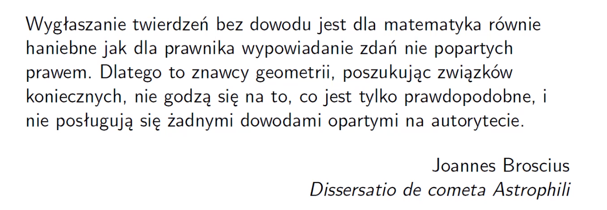
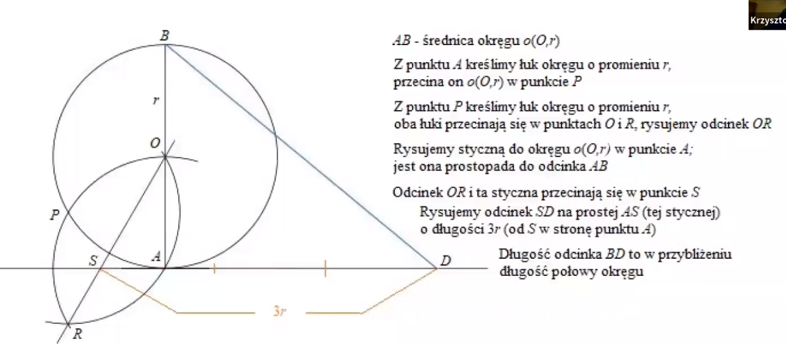
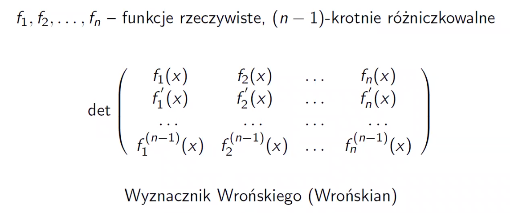
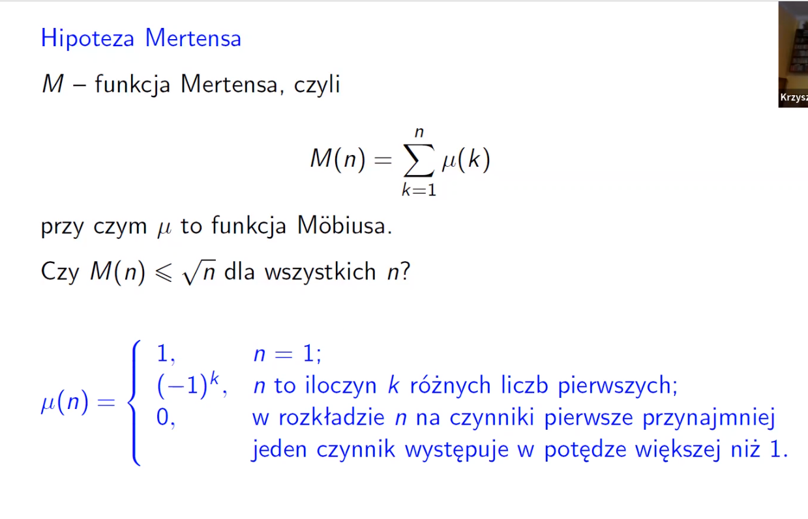
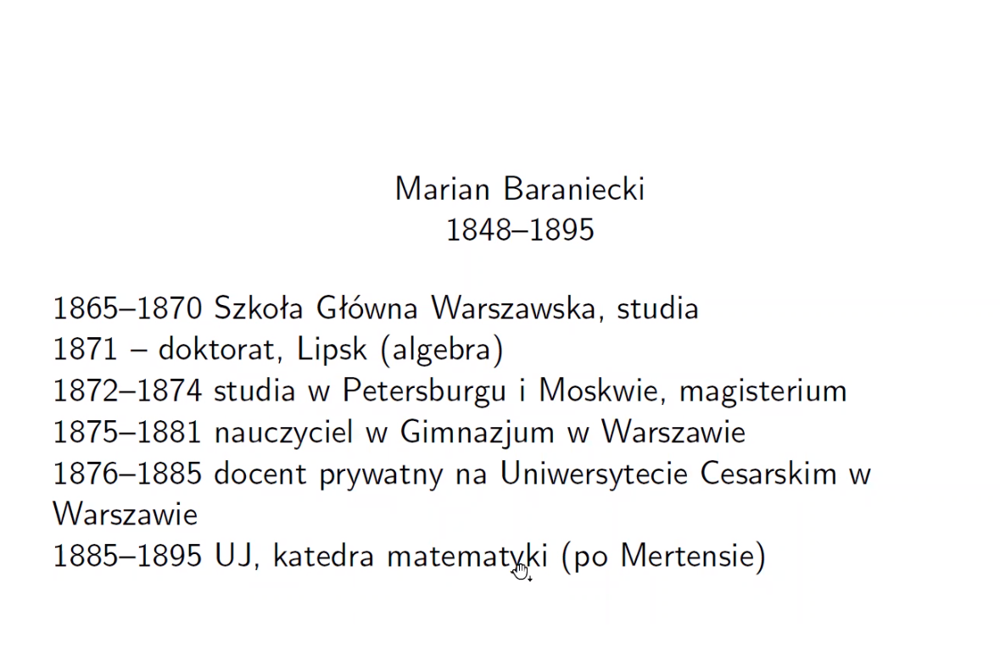
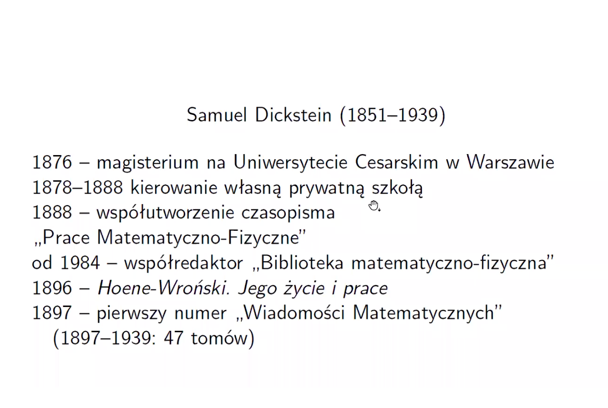

# Wykład 07: 13.04.22   - Osiągnięcia matematyków polskich do końca XIX w.

Tagi: [Początki matematyki w polsce]

## Wstęp
Mit - w polskiej matematyce nie było nic przed 1 wojną światową.\
W 16 i 17 wieku eksplozja matematyki

## Erazm Witelo
Żył około 1230 - 1314 (niepewne niektóre pozycje podają 1280)\
Książka Perspectiva 1273 rok (wydanie drukiem 1535) - Podstawy geometryczne optyki\
Z tego dzieła kożystał Leonardo da Vinci\
Johannes Kepler napisał dopełnienie do Witelona\
Witelo żył na dolnym śląsu\
Studiował w Paryżu\
Przedstawiał sie jako "Witelo, syn Turyngów i Polaków"

## Uniwersystet Jagieloński
Najstarsza polska uczelnia (1364)\
Najstarszy budynek Collegium Maius\
Pomnik kopernika stał tam na placu.\
Pomnik został przeniesiony przed Collegium Witkowskiego

Nauczano trivum:\
gramatyka, retoryka, dialektyka\
I quadrivium:\
Arytmetyka, geometria, astronomia, muzyka

Pierwsza katedra matematyki - 1405 \
Ufundowana przez Jana Stobner

Druga katedra związana z matematyką - 1450 - Katedra astrologii\
Fundowana przez Marcin Król z Żórawicy\
Król zreformował studia matematyczne

w latach 1448-1471 5 wyedukowanych w Krakowie kierowało katedrą matematyczną w Bolonii\

## Mikołaj Kopernik
Obraz Mikołaja Kopernika w Collegium Novum (Universytet Jagieloński)\
Obraz zatutułowany Rozmowa z Bogiem\
Żył w latach 1473 - 1543\
Związany z astronomią, ale również matematyką\
Studiowal na Uniwersytecie Jagielońskim w 1491 roku\
Napisał De revolutionibus\
Rękopis znajduje się w bibliotece uniwersytetu Jagielońskiego.\
Obraz Rozmowa z Bogiem była na znaczku w związku radzieckim i na różnych innych znaczkach

### Twierdzenie Kopernika
Tocząc okrąg wewnętrznie styczny do innego okręgu kreślimy krzywą.\
Długość stworzonej krzywej, przez mniejsze kolo o średnicu równej promienia większego okręgu to średnica dużego okręgu.\
Znajduje się w De revolutionibus

### Przystawalność trójkątów sferycznych
Równość kątów dwóch trójkątów sferycznych wystarczy do przystawalności\
Dowiedzione przez Mikołaja kopernika

## Jan Brożek (Brzozek)
Żył w latach 1585 - 1652\
Między innymi matematyk, astronom, fizyk, teolog, ksiądz, historyk nauki i rektor Uniwersytetu Jagielońskiego i jej dobrodziej (sponsor)\
Po łacienie Joannes Broscius (tak się podpisywał)\
Nie jest do końca jasne jak nazywał się po polsku\
\
!!Uwaga daty na zdjęciu błędne (tam gdzie jest 19** powinno być 16**)

W testamencie hojnie obdarzył uniwersystet jagieloński. Żądał aby śpiew chóralny odbywał się według przepisów sztuki, polegających na zastosowaniu matematycznych prawidzeł harmonii.

Podarował bibliotece Collegium Maus ok 2000 książek

Nie zostawił potomka

### Rozprawa o geodezji odległości - 1610
Figury izoperymetryczne - o różnych obwodach\
Z obwodu nie można wnioskować nic o polu (błąd w pracy Polibiusza)

### Praca o formie komórek budowanych przez pszczoły - 1611
Udowodnił ze ze wszystkich identycznych figur którymi można wypełnić płaszczyznę, największe pole ma sześciokąt foremny.

## Arithmetica integrorum - 1620
Całokształt znnej w tym czasie arytmetyki liczb całkowitych

### Apologia pro Aristotele et Euclide
Pokazał, że pewne liczy nie są jednka doskonałe\
Reguły podzielności liczb postaci $2^n - 1$ (konstrukcja sita)\
17296 i 18416 to liczby zaprzyjaźnione (wcześniej pokazał Fermat)\
Wielokąty gwiaździste

### Podróż do Warmii i Prus
Miejsca związane z kopernikiem\
Przywiózł wiele materiałów:\
Pierwsze wydanie De revolutionibus orbium coelestium\
Kopia portretu ojca mikołaja kopernika\
Listy kopernika i retyka

Planował napisanie obszernej biografi kopernika (nie udało się)

### Cytat o nim

## Adam Adamandy Kochański - 1631 - 1700
Nadworny matematyk Jana III Sobieskiego do 1685\
Od 1686 był bibliotekarzem\
Studiował w akademi wieleńskiej\
1655 - wyjazd z polski\
Studiował w Molsheim\
Korespondował z Leibnizem

Od 1690 wrócił do Warszawy

### Rektyfikacja okręgu (praca Acta Eruditorium)
Konstrukcja odcinka o dlugości danego okręgu\
Pokazał konstrukcje przybliżoną\

### Kwadratura koła
Konstrukcja kwadratu o polu równym polu danego koła\
Nie jest możliwa za pomocą cyrkla i linijki

## Jan Śniadecki - 1756 - 1830
Astronom i matematyk\
Mickiewicz krytykował Śniadeckiego w wierszu (szkiełko i oko)\
Studiował w krakowie - 1772 - 1774\
Wykładał 1774 - 1778\
Za granicą 1778 - 1781\
Kraków 1781 - 1803\
Wilno 1805 - 1830

Przed jego narodzeniem "pustynia matematyki" w polsce (po śmierci Kochańskiego)

1781 - 1797 - katedra matematyki wyższej i astronomi\
Od jego czasow powstały dwie katedry:\
Matematyka wyższa \
Matematyka elementarna

Nie posiada wielu osiągnięć matematycznych ale pisał książki\
Miał kontakty z d'alembertem

Różne terminy matematyczne wprowadził w polsce\
Np: rachunek różnicowań, całość (całka), rachunek przemienności (rachunek wariacyjny), pochodna, funkcja pierwotna, ostrosłup.\
Nieprzyjęte nazwy: ostrokrąg(stożek), rachunek chybił-trafił(rachunek prawdopodobieństwa), ledwo-nieczysta (asymptota), wystawa(sinus), dostawa(cosinus)

### Rachunek zdarzeń i przypadków losu - 1790
Niewydana tylko rękopis

### Rachunek algebraiczy teorya
Pierwsza książka w polsce stojąca na poziomie europejskim

### Jeografia
Opisanie matematycznie i fizyczne ziemi

### Trygonometria Kulista analitycznie wyłożona

## Józef Maria Hoene-Wroński - 1776 - 1853
Matematyk, filozof, oficer, ekonomista, prawnik\
Od okolo 1800 zamieszkał we francji \
W wielu 16 lat został wojskowym (zmienił nazwisko aby ukryć się przed ojcem)\
Ojcu nie podobała się jego kariera wojskowa\
Zdradził fortywikacje warszawskiej pragi wojskom rosyjskim, ponieważ był w niewoli\
We francji doznał objawienia (stad imie maria)

### Wyznacznik Wrońskiego

## Franciszek Mertens - 1840 - 1927
Kierował katedrą na UJ 1865 - 1884\

Matematyk polsko austraicki

### Twierdzenie Mertensa - 1874
Jeżeli jeden szereg jest zbieżny, a drugi zbieżny bezwzględniue to iloczyn Cauchiego ich jest zbieżny

## Hipoteza Mertensa
\
Jeżeli hipoteza mertensa jest prawdziwa to prawdziwa jest hipoteza riemana\
Niestety hipoteza mertensa nie jest prawdziwa

### Analityczna teoria liczb
O rozmieszczeniu liczb pierwszych wśród liczb naturalnych

## Marian Baraniecki - 1848 - 1895
\
1882 - inicjator, redaktor i wydawca biblioteki matematyczno fizycznej\
Wydał:\
Teoria wyznaczkinków - 1879\
Początkowy wykład syntetyczny własności przecięć stożkowych - 1885

## Samuel Dickstein - 1851 - 1939
\
Profesor Uniwersytetu Warszawskiego

## Ludwik Antoni Birkenmajer - 1855 - 1929
### III problem hilberta
Rozwiązany w 1884 przez ludwika (w ramach konkursu akademii umiejętności w krakowie)

## Kazimierz Żorawski - 1866 - 1953
Geomertia różniczkowa, teoria grup Liego\
W krakowie 1895 - 1919\
1917/1918 - rektoj UJ\
1919 w warszawie\
Prezes towarzystwa naukowego warszawskiego

## Stanisław Zaręba - 1863 - 1942
Równania różniczkowe\
Uzyskał doktorat w Sorbonie - 1890\
W sorbonie dwa rodzaje doktoratów:\
Dla obcokrajowców, łatwiejszy (Doctores de l'Universite)\
Dla francuzów, trudniejszy (Doctores es Scientes Mathematiques)\
Zaręba zrobił trudniejszy\
Rozwiązał konkurs z 1858 po 30 latach Paryskiej Akademi nauk dotyczące problemu stanu cieplnego nieograniczonego ośrodka jednorodnego (nie uznano rozwiązania riemana, a zaręba uzupełnij jego luki w rozwiazaniu)\
Jedym z recenzentów był Darboux\
Opublikował 7 prac we francuskich poismach\
Wrócił do polski w 1900 roku
