# Wykład 10 "Polska matematyka 1900-39"
Mit pierwszy: nie było czegoś takiego, jak "Polska szkoła matematyczna"! Bo nie było jedności tematyki, miejsca. Zamiast tego były: Lwoska szkoła matematyczna i Warszawska szkoła matematyczna, bo były zarówno jedność tematyki, ludzi, miejsca i czasopisma (Krakowskiej szkoły matematyczniej też **nie** było i nie ma).
W Polsce z okresu międzywojennego było 5 ośrodków uniwersyteckich: Poznań, Warszawa, Kraków, Lwów i Wilno. W każdym było coś ważnego dla polskiej matematyki.
## Kraków
### Kaziemierz Żorawski (1866 - 1953)

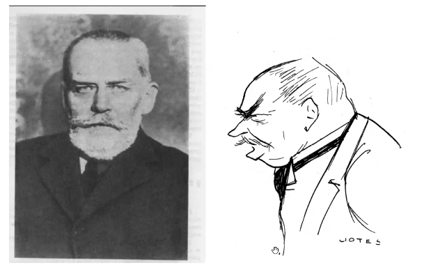
Profesor UJ w latach 1895-1919 (ponad 20 lat); 1917/18 rektor UJ. Poźniej z ważnych przyczyn patriotycznych, przeniósł się do Warszawy (został tam do końca zycia), gdzie w latach 1926-1931 był prezesem Towarzystwa Naukowego Warszawskigo (poniżej: medal z jego podobizną)

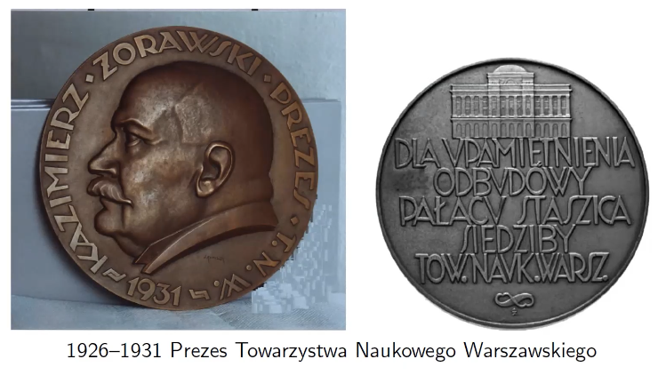
### Stanisław Zaremba (1863-1942), równania różniczkowe

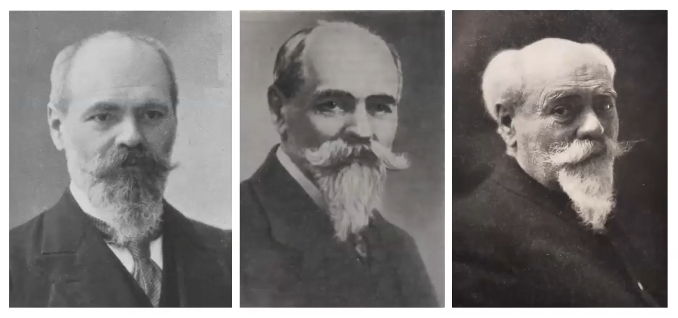
W doktoracie rozwiązał problem atakowany przez ponad 30 lat. 
#### W Krakowie (1900-42)
Zrobiłby łatwiej światową karierę, gdyby te same wyniki uzyskał we Francji.
1. Wyniki naukowe.
2. Szeroko pojęta praca dydaktyczna.
3. Polskie Towarzystwo Matematyczne + działalność na świecie (działalnośc organizacyjna).
W 1908, wykład sekcyjny na International Congress of Mathematicians, Rzym (kongres matematyków w Rzymie). Nie był pierwszym takim polakiem, a drugim. Pierwszy był Samuel Dickstein, historyk matematyki.

W 1921 założył czasopismo (wciąż działające pod innym tytułem) _"Annales de la Société Polonaise des Mathématiques"_.

Zajmował się głównie równaniami różniczkowymi cząstkowymi. Przykład Zaremby (bardzo ważne równanie różniczkowe)
$$
\Delta u = 0, \text{ albo } \nabla^{2} u = 0
$$
(gdzie operatory to Laplacian) zrobiony jak był w Krakowie. Szukamy $u \in C^{2}(D), u \in C(\overline{D})$, gdzie $\nabla^{2}u = 0, u = \omega$ dane na $\partial D$, gdzie $D$ to obszar ograniczony (w przykładzie: koło, z którego wyrzucono środek). Pytanie było: "Czy taki problem zawsze ma rozwiązanie?" Zaremba podał przykład, że może _nie_ mieć:

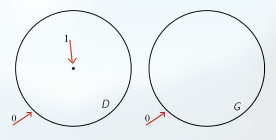
Jeśli prawe ma rozwiązanie to unikatowe, ale jeśli lewe ma, to jest też rozwiązaniem prawego, czyli miałoby 2 rozwiązania — sprzeczność.

Przykład ten został wymieniony w _"Development of mathematics 1900-50"_, Jean-Paul Pier (red.), w których wymienia najważniejsze osiągnięcia matematyki w poszczególnych latach; jednym z osiągnięć w 1909 był właśnie przykład Zaremby (tuż obok metody rzutów ortogonalnych w teorii problemu Dirichleta wprowadzona przez Zarembę).

W 1902 napisał pracę, którą później analizował H. Poincaré w _"Analyse d'un mémoire de M. Zaremba"_, która ukazała się w _"Bulletin des sciences mathémaiques"_ (1902); w całości poświęcona analizie jego wyników.

Wprowadził jądro reprodukujące (1907, 1909 — daty prac), nazywane przez wszystkich jądrem Bergmana (15 lat wcześniej Zaremba wprowadził).

Pięciokrotnie (5) wygłaszał wykłady sekcyjne na ICM:
1. 1908 Rzym;
2. 1920 Strasbourg;
3. 1924 Toronto;
4. 1932 Zürich;
5. 1936 Oslo.
(najwięcej z Polaków; więcej niż 5 ma 6-ciu matematyków, a dokładnie — 8.)

Napisał ponad 100 prac badawczych. Kilka cytatów o nim:
1. Henri Lebesgue: _"Zaremba nie ogłosił żadnej pracy niepotrzebnie."_
2. Gorges Bouligand: _"Wkład Zaremby w rozwój teorii problemu Dirichleta jest taki sam, jak Poincarégo i Lebesgue'a."_
3. Henri Lebesgue: _"Aktywność naukowa Zaremby zaważyła na tak wielu terenach badań, że nazwisko jego nie może być obce nikomu, kto interesuje się matematyką."_
4. Émile Picard: _"Zaremba jest jednym z najznamienitszych matematyków naszych czasów. Jego pięknce prace z teorii równań różniczkowych i teorii funkcji harmonicznych są podziwiane przez wszystkich zajmujących się analizą."_
5. Jacques Hadamard: _"Głębokie, pochodzące od Zaremby uogólnienie przekształciło podstawy teorii potencjału i stało się natychmiast punktem wyjścia do badań młodych matematyków szkoły francuskiej."_

Napisalł 7 podręczników:
1. Zarys pierwszych zasad teorii liczb całkowitych (1907)
2. Teoria wyznaczników i równań liniowych (1909)
3. Arytmetyka teoretyczna (1912)
4. Wstęp do analizy, część I (1915)
5. Wstęp do analizy, część II (1918)
6. Zarys mechaniki teoretycznej, tom I (1933)
7. Zarys mechaniki teoretycznej, tom II (1939)
> Moim zdaniem chodzi przede wszystkim o to, żeby nasza młodzież mogła pobierać ogólne wykształcenie z książek napisanych w języku ojczystym ~ Zaremba, przedmowa do "Teorii wyznaczników"

1. 2.04.1919 (2.IV.1919) założenie "Towarzystwa matematycznego" w Krakowie, Zaremba wybrany prezesem (1919-21). Od 1920: "Polskie Towarzystwo Matematyczne".
2. 1920 — ICM w Strasburgu. Utworzenie Międzynarodowej Unii Matematycznej. Akt założycielski: 11 państw, Polskę reprezentował Zaremba.
3. 1932 — ICM w Bolonii, wiceprzewodniczący Kongresu (ważny kongres, bo uchwalono medal Fieldsa — najważniejsze wyróżnienie w matematyce.)
Do ok. 1930, najbardziej rozpoznawalnym polskim matematykiem był Stanisław Zaremba.

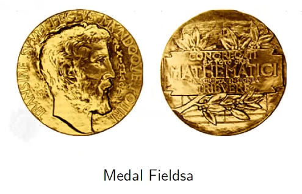
> W historii matematyki polskiej stanowi Prof. Zaremba epokę — właściwie od objęcia przez niego katedry na Uniw. Ja. [UJ] rozpoczęła się nowoczesna era panowania precyzji nieznanej dotąd w Polsce ~ Witold Wilkosz, Tadeusz Ważewski.

Z okazji kongresu matematyków w Warszawie, powstała seria znaczków z czterema (4) matematykami: 

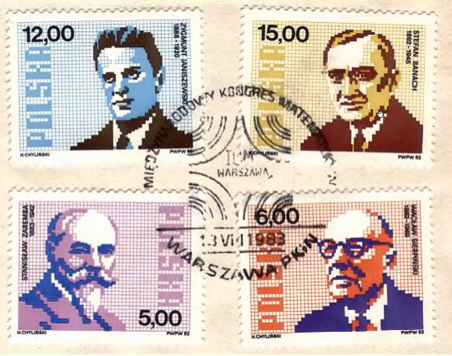

Ulica Zaremby w Krakowie krótka, ale jest jedyny skup metali kolorowych.

### Hugo Steinhaus (1887-1972)

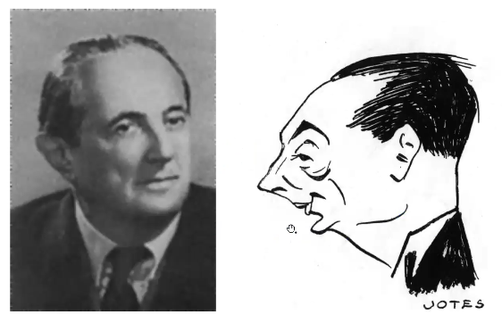 
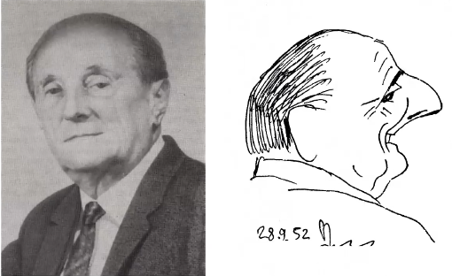
Doktorat w Götingen pod kierunkiem Davida Hilberta. Przyjechał do Krakowa na kilka miesięcy. Napisał m.in. _"Kalejdoskop Matematyczny"_ oraz "Orzeł, czy Reszka", ale sławny też z aforyzmów, krótkich, trafnych powiedzeń — hugonotki. Np.:
1. Kula u nogi — Ziemia.
2. Przyrząd do amputowania nóg futbolistom — piłka nożna.
3. Taki, co nie dopuszcza innych do WC — nieustępliwy.
4. W poczekalni u dentysty — kolejka zębata.
[Jest lista mała](https://aforyzmy-cytaty.pl/autor/steinhaus-hugo.html) W Götingen jest zwyczaj umieszczania tabliczek na domach, w których mieszkali studenci, którzy uzyskali później sławę. 

### Pierwsze ważne wydarzenie (1916)
Uwagę Steinhausa podczas spaceru zwróciła dwójka studentów rozmawiających o całce Lebesgue'a (nowa rzecz w tamtych latach). Byli to [Stefan Banach](#Stefan Banach 1892-1945) i Otton Nikodym (została ławka na Plantach) (mieli też trzeciego kompana, choć nie na miejscu, Witolda Wilkosza) (Steinhaus był od nich starszy tylko o 5 lat)

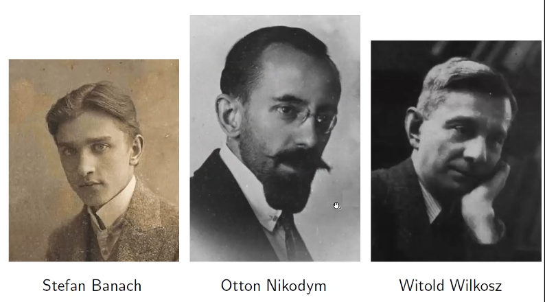
Steinhaus powiedział im o problemie, nad którym pracował. Później przyszedł do niego Banach z gotowym rozwiązaniem, po czym ten otoczył go opieką

Miały miejsce 2 ważne wydarzenia: 
1. _"Odkrycie"_ Banacha przez Steinhausa 
2. Memoriał Janiszewskiego (Janiszewski) "O potrzebach matematyki w Polsce" (na kursie w moodlu).
## Warszawa
Centralna postać: Wacław Sierpiński
### Stanisław Mazur (1905-1981)

Ufundował żywą gęś za rozwiązanie jednego z zadanych przez siebie problemów. Rozwiązał Per Enflo (Szwed) (1927).

### Wacław Sierpiński (1882-1969)
(teoria liczb, teoria mnogości, topologia)

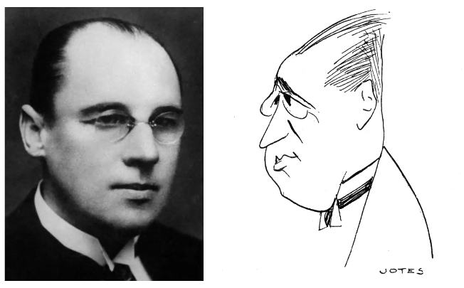

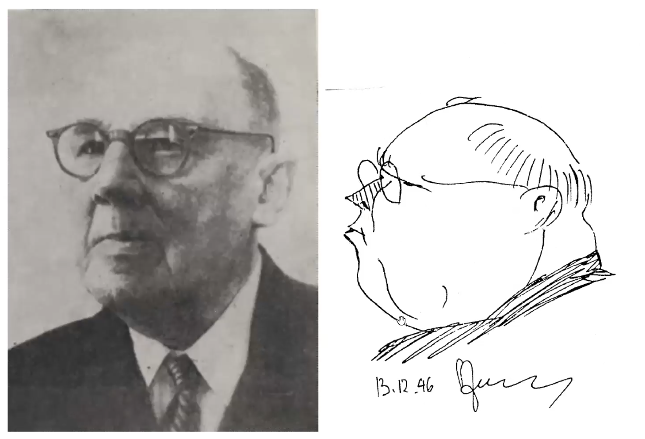

1. Dywan Sierpińskiego: dzielimy na 9, wyrzucamy środkowy i rekurencja na po pozostałych (wymyślił **Mazurkiewicz** w 1915).
2. Trójkąt Sierpińskiego.
3. Krzywa Sierpińskiego 
   

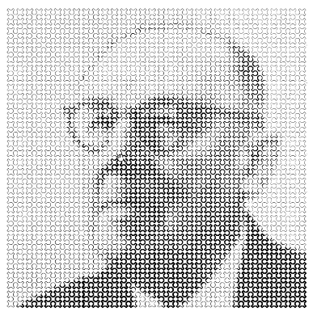

4 wykłady na ICM (1924 Toronto, 1928 Bolonia, 1932 Zurych (plenarny), 1936 Oslo) 
### Zygmunt Janiszewski (1888-1920)
(doktorat: 1911 Paryż; komisja: Poincaré, Lebesgue, Fréchet) W 1917 tekst "O potrzebach matematyki w Polsce" (to nie tak, że dostał pomysł, a to uczeni zostali poproszeni o "O potrzebach \_\_ w Polsce" i Zaremba, i Janiszewski odpowiedzieli o matematycznych; co ciekawe, z odmiennymi wizjami)
> [...] należałoby założyć u nas czasopismo ściśle naukowe, poświęcone wyłącznie jednej z tych gałęzi matematyki, w których mamy pracowników wybitnych, prawdziwie twórczych i licznych.

 Podobne idee miał Sierpiński. Miał też ideę o wyłączności przyznawania doktoratów jednemu uniwersytetowi w każdej dziedzinie (np. biologii, matematyce), z możliwością nadawania prawa przyjmowania prac doktorskich przez profesorów innych uniwersytetów. 

Zainicjował powstanie Fundamenta Mathematicae (1920, nie dożył)

### Kazimierz Kuratowski (1896-1980)
(teoria mnogości, topologia, też znany z teorii grafów)

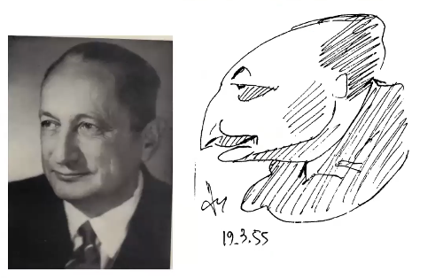
### Bronisław Knaster (1893-1980)
(topologia) Pseudołuk, continuum Knastera (1922)

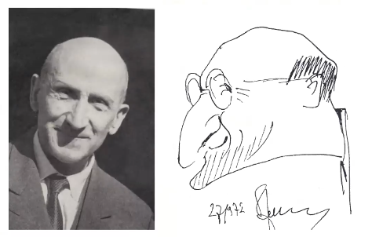
### Stefan Mazurkiewicz (1888-1945)
(topologia) 

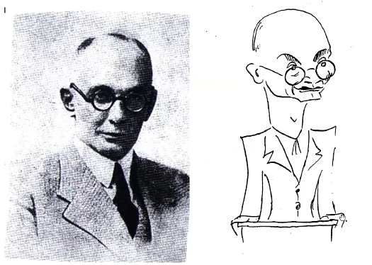
### Karol Borsuk (1905-1982)
(topologia geometryczna)

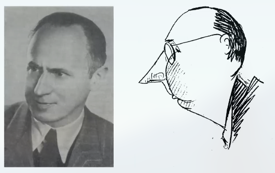

## Lwów
Centralna postać: Stefan Banach
### Stefan Banach (1892-1945)

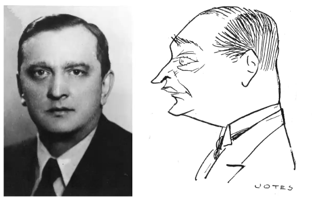
(historia dzieciństwa: dziecko nieślubne Katarzyny Banach — służącej pewnego oficera armii austriackiej — i Stefana Greczka (Greczek) — podoficera. Armia austriacka nie zgodziła się na ślub.)
Jeden z 3, których osiągnięcia przewyższają wszystkie inne osiągnięcia polskich uczonych (obok Kopernika i Skłodowskiej-Curie). W bazie publikacji zbMATH (jak jakkolwiek ważna praca, to streszczana) Banach wymieniany w tytułach jest ponad 27480 razy (nawięcej wśród matematyków (stan na 10.05.22)).
Po skończeniu szkoły, trafił na politechnikę Lwowską (1910) (matematyką się interesował, ale był przekonany, że wiele więcej ciekawego nie da się zrobić, więc chciał na technicznej, a takiej w Krakowie nie było). Studiował, zrobił półdyplom. Wrócił do Krakowa. Zbużono kamienicę, w której mieszkał.

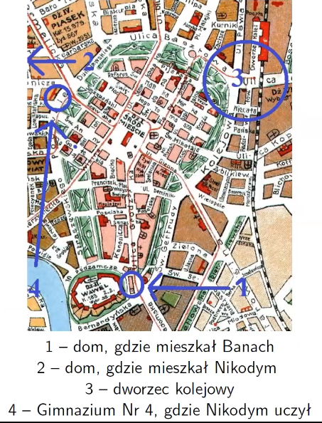
W 1920, Steinhaus załatwił mu stanowisko asystenta na politechnice Lwowskiej. Doktorat 1920/21 na uniwersytecie Jana Kazimierza w Lwowie: przestrzenie Banacha "O operacjach na zbiorach abstrakcyjnych i ich zastosowaniach do równań całkowych" opublikowany w 1922 po francusku w Fundamenta Mathematicae.
Historia o tym, że ktoś zapisał jego pracę i nieświadomie obronił to bzdura. Było tak:
1. 1920 — Banach przyjeżdża do Lwowa.
2. 24.06.1920 — Składa pracę doktorską na Wydziale Filozoficznym Uniwersytetu Jana Kaziemierza we Lwowe.
3. 30.10.1920 — Wspólna recenzja (Steinhaus, Żyliński)
4. 3.11.1029 — Egzamin doktorski (zdany "z wyróżnieniem")
5. 11.12.1920 — Egzamin z filozofii
6. 22.01.1921 — Promocja doktorska (promotor: Twardowski)
Więc w tempie przyspieszonym.

#### Przestrzeń Banacha(-Wienera)
Przestrzeń wektorowa, unormowana, zupełna (każdy ciąg Cauchy'ego jest zbieżny). Wprowadzenia terminów:
1. przestrzeń Banacha: René Maurice Fréchet (1926)
2. przestrzeń typu (B): Steinhaus (1929)
3. algebra Banacha: Ambrose Warren (1945)

Tomothy Gowers dostał Medal Fieldsa za osiągnięcia związanie właśnei z przestrzeniami Banacha (1998)
#### Analiza funkcjonalna
1927-1930
- Twierdzenie Banacha-Steinhausa (1927)
- Twierdzenie Hahna-Banacha (1929)
- Twierdzenie Banacha o wykresie domkniętym, o odwzorowaniu otwartym.
- Studia Mathematica (1929; red.: Banach, Steinhaus)
Prace:
- 1931: Teoria operacji. Tom I. Operacje liniowe.
- 1932: Théorie des opérations linéaires (powyższe po francusku. **Wtedy** świat matematyczny zorientował się o wynikach Banacha), Monografie Matematyczne 1
#### Twierdzenie Banacha o punkcie stałym 

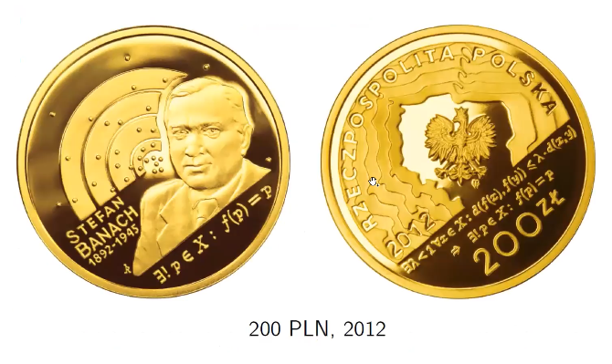
#### Katedra
Nie zdąrzył objąć przyznanej mu katedry, bo zmarł.
### Otton Nikodym (1887-1974)
Studia: Uniwersytet Cesarza Franciszka I we Lwowie, ukończone 1911. Od 1911, nauczyciel w Gimnazjum Nr. 4 w Krakowie. Żona — Stanisława — też matematykiem. 
Historia doktoratu Banacha może bzdurą, ale miała inspirację w historii Ottona: to on nie chciał zostać doktorem "Czy ja od tego stanę się mądrzejszy". Pracę napisał, ale nie chciał zdawać egzaminu. Sierpiński umówił spotkanie w kawiarni, później pojawił się dziekan Wydziału Filozoficznego i po godzinnej rozmowie pogratulował zdania egzaminu.
Twierdzenia:
1. Twierdzenie Radona-Nikodyma (Radon 1913; uogólnienie Nikodym 1930)
2. Twierdzenie Nikodyma-Grothendicka (Nikodym 1933, uogólnienie Grothendick ≈ 1955)
### Kawiarnia Szkocka (1928, 1978)

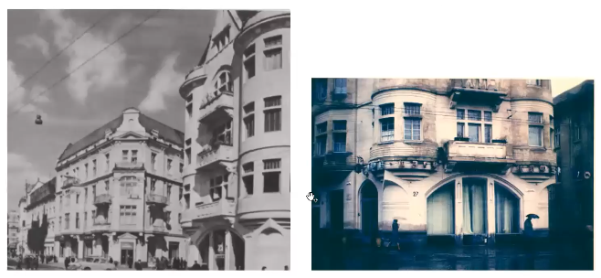
**Księga szkocka** — Łucja, żona Banacha, założyła zeszyt trzymany w restauracji, przynoszony matematykom, gdzie zapisywano problemy, nagrody za rozwiązanie etc. Przetrwała wojnę i została wydana po ang. Się okazało, że każdy problem był początkiem późniejszych, interesujących badań.

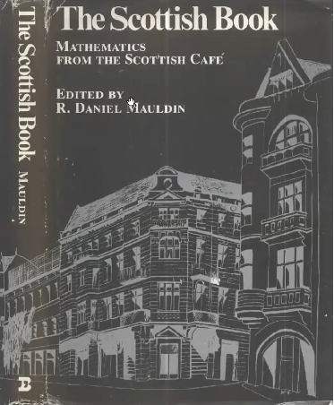
## Wilno
### Antoni Zygmunt (1900-1992)
(funkcje rzeczywiste, rachunek prawdopodobieństwa)

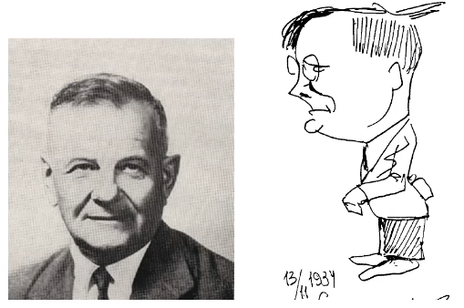
### Józef Marcinkiewicz (1910-1940)
(uczeń powyrzszego, zamordowany w Katyniu)

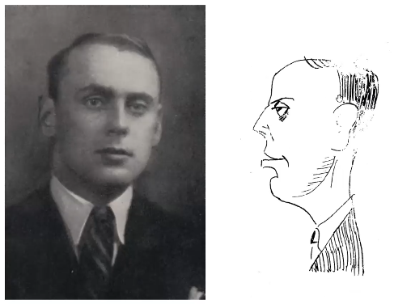
W wieku 30 lat miał 53 opublikowane prace (i to dobre; mógłby mieć duże szanse na Fieldsa); Banach, tylko 7.
## Poznań
1. Marian Rejewski (1905-1980)
2. Jerzy Różycki (1909-1942)
3. Henryk Zygalski (1908-1978)

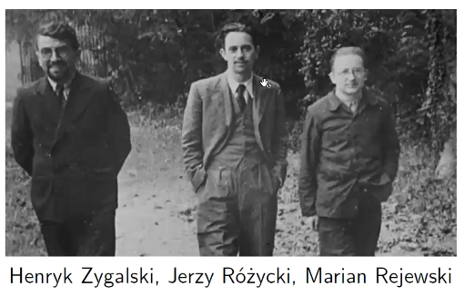
## Zaproszenia na wykłady ICM (1904-1936)
- 5 Stanisław Zaremba
- 4 Wacław Sierpiński (w tym planarny)
- 4 Stanisław Gołąb
- 4 Alfred Rosenblatt
- 3 Bronisław Knaster
- 3 Franciszek Leja
- 2 Stefan Banach (w tym planarny)
- 2 Karol Borsuk
- 2 Aleksander Grużewski
- 2 Stefan Kaczmarz
- 2 Kazimierz Kuratowski
- 2 Stanisław Mazur
- 2 Halina Milicer-Grużewska
- 2 Stanisław Saks
- 2 Juliusz Schauder
- 2 Witold Wilkosz
- 2 Antoni Zygmund
- 1: Biernacki, Chwistek, Dickstein, Eilenberg, Janiszewski, Lubelski, Łukasiewicz, Mazurkiewicz, Neyman, Nikliborc, Nikodym, Nikodymowa, Orlicz, Smoluchowski, Steinhaus, Szpilrajn (Marczewski), Tarski, Ulam, Ważewski, Zarankiewicz, Żyliński.
## Wymienieni w Development of Mathematics 1900-1950
Stefan Banach, Karol Borsuk, Stefan Kaczmarz, Bronisław Knaster, Kazimierz Kuratowski, Józef Łukasiewicz, Józef Marcinkiewicz, Stanisław Mazur, Stefan Mazurkiewicz, Otton Nikodym, Juliusz Schauder, Wacław Sierpiński, Hugo Steinhaus, Alfred Tarski, Stanisław Zaremba, Antoni Zygmund