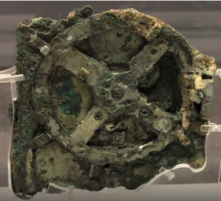
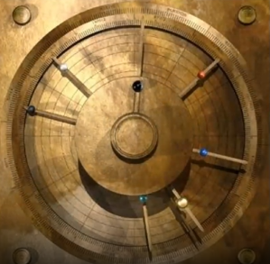
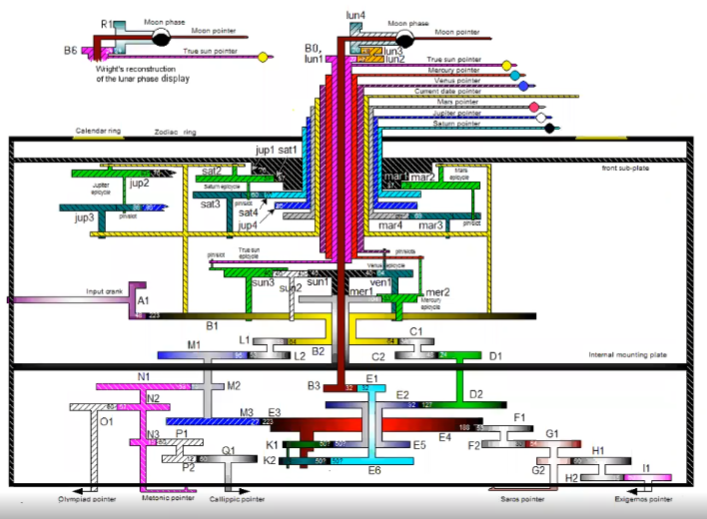
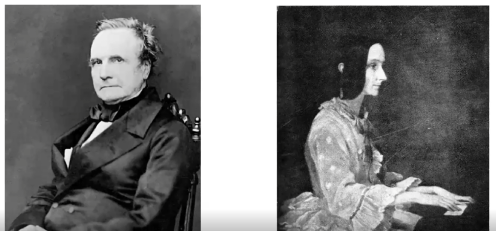
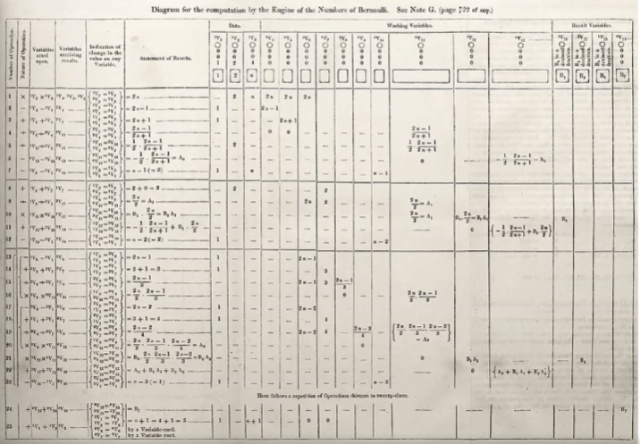

# Wykład 12: 25.05.2022 - Jak informatyka wyrosła z matematyki i jakie ma z nią relacje?

(Ostrzegam, że to bloat, ale nie ma udostępnionej prezentacji.)

## "*Computer science is no more about computers than astronomy is about telescopes*"- Edsger Dijkstra

Komputer nie jest przedmiotem badań informatyki, ani historia informatyki nie jest historią powstania komputera.

## Informatyka - Co to?

Informatyka jest dziedziną rozpiętą pomiędzy:

- Matematyką - wdraża idee matematyczne i stosuje rozumowania dedukcyjne.

- Technologią i inżynierią - tworzy programy i systemy metodami inżynierskimi.

- Nauki empiryczne - bada programy obserwując je

## Symboliczny początek informatyki

Powstanie kompilatora języka COBOL. 1960

Zastosowania biznesowe w inwentaryzacji, rozliczeniach, działalność bankowa,...

Dalej jest używany. (Stare systemy dalej są utrzymywane w działaniu.)

W momencie powstania COBOL'a matematyka (wyższa w domyśle) przestała być niezbędna w informatyce. Używanie COBOL'a jest pracą całkowicie inżynierską.

## Korzenie informatyki

Można nazwać informatykę przed komputerami proto-informatyką lub pre-informatyką.

### Początki początków

- Liczenie i arytmetyka
- Sposoby (algorytmy) obliczeń zależne od sposobu liczby
  - Jak dodawać?
  - Jak odejmować?
  - Jak mnożyć?
- Spisywanie/tablicowanie przydatnych funkcji
  - Mezopotamia
  
    Dzielenie było wykonywane poprzez mnożenie przez odwrotność.

    Trzymano zatem tablice z odwrotnościami liczb.

  - Egipt

    Ułamki zapisywano w postaci sum koniecznie różnych liczb w postaci $\frac1n$.

    Trzymano więc na papirusach gotowe rozkłady ułamków na takie liczby.

    (Np. zapisanie $\frac27$ może być trudne.)

### Pierwsze maszyny

- Abakus - Mezopotamia, Egipt, Persja, Grecja

### Starożytne algorytmy

- Algorytmy arytmetyczne - np. rozwiązywanie równań kwadratowych
- Algorytm Euklidesa
- Sito Eratostenesa (Na prezentacji było jak działa, nie będę tego tutaj rysował.)
- Konstrukcje geometryczne - np. znalezienia prostej prostopadłej przechodzącej przez punkt

  Jest to pewien sposób obliczeń i algorytmów na kształtach.

### Katalog Biblioteki Aleksandryjskiej

Katalog nazywał się *Pinakes* i został stworzony przez Kallomachosa.

*Pinakes* to spis bibliograficzny z podziałem na zawężające się kategorie. Dzieła z danej podkategorii posortowane alfabetycznie wedle imion autorów.

- Jest to przykład pracy informatyczno-algorytmicznej dotyczącej przetwarzania i katalogowania danych.

- Ani dane, ani cel nie były związane z matematyką. Był to sygnał, że informatyka oddzieli się od matematyki, zamiast stać się jej gałęzią.

- Wyszukiwanie binarne i sortowanie jako znane metody działania.

- Zaczątki drzewa jako organizacji danych.

### Maszyna z Antikythiry

Jest to przykład jednego z pierwszych mechanicznych poprzedników komputera. Nie wiemy do końca jak wyglądała i działała w całości.

To jest jeden z możliwych schematów działania urządzenia.

Urządzenie było kalkulatorem astronomicznym.

Jest to najstarszy znany (znaleziony) komputer analogowy, ale po złożoności urządzenia możemy się spodziewać, że w rzeczywistości nie było pierwszym obiektem tego rodzaju.

Maszyne z Antikythiry datuje sie na II - I p.n.e. i przypuszcza się, że mogła powstać na Rodos.

### Początki algorytmów

- Muhammad ibn Musa al-Chuwarizmi (ok. 780 0 850)

  Napisał traktat wychwalający liczby indyjskie (które my znamy jako arabskie). Oryginał się nie zachował, jednak był on wspominany/cytowany w:

  - "*Dixit Algorizmi*"
  - "*Liber Alchoarismi de Practica Arismetice*"
  - "*Liber Ysagogarum Alchorismi*"
  - "*Liber Pulveris*"

  Muhammad argumentował, że wykonywanie obliczeń na liczbach indyjskich (arabskich) jest duzo prostrze.

  Sytuacja jest interesująca, ponieważ mimo tego że liczby są niby te same, to algorytmy obliczeń na liczbach arabskich są dużo prostrze.

  Słowo algorytm pochodzi od al-Chuwarizmi. (Chuwarizmi to miasto w Iranie.)

### Konkordacja Hugona de Saint-Cher

- "*Concordatiae Sacrorum Bibliorum*", ukończona w 1267 przez wielu skrybów klasztoru dominikańskiego.
- Alfoabetyczny spis wszystkich słów z "*Wulgaty*". (łacińskie tłumaczenie Bibli)
- Każdemu słowu były przypisane wszystkie wystąpnienia.
- Później rozbudowane do "*Concordatiae maximae*", z dodaniem kontekstów

Dzieło pozwalało w jakich innych miejscach Biblii i w jakich kontekstach, dane słowo zostało użyte.

Dlaczego ważne?

- Manualna zespołowa realizacja algorytmu rozproszonego.
- Ponowny po "*Pinakesie*" przykład przetwarzania danych.
- Wyszukiwanie binarne i sortowanie.
- Jest to rodzaj indeksu. (Jak katalog biblioteki.)

### Logarytmy

"*Mirifici Logarithmorum Canonis Descriptio*" John Napier 1614

- Metoda szybkiego mnożenia wzorem

  $\log(a\cdot b)=\log a + \log b$

  Tablice logarytmiczne pozwalały na szybkie przybliżone obliczenia.

- Logarytmy pozwoliły na konstrukcję suwaka logarytmicznego. (poprzednik kalkulatora)
- Wcześniej używano do tego tablic trygonometrycznych.
- Logarytm okazał się ważną funkcją w informatyce, ale nie z powodu szybkiego mnożenia.

### Charles Babbage i Ada Lovelace

#### Pseudokot programu maszyny analitycznej

Jest to napisany przez Lovelace diagram obliczania liczb Bernouliego przez maszynę zbudowaną przez Babbage'a.

Jest to pełny opis algorytmu.

Kod maszynowy był zapisywany na kartach dziurkowanych.

### Maszyna analityczna 1830

- Pierwsza maszyna analityczna o uniwersalnej mocy obliczeniowej. (w granicach pamięci)
- Była napędzana maszyną parową.
- Nigdy nie została fizycznie zbudowana.
- Projektując ją, Babbage przewidział potrzebę analizy złożoności algorytmów.

### Spis powszechny 1890 w USA

- Technologia Hermana Holleritha.
- Przetworzenie danych w spoób półautomatyczny w oparciu o karty dziurkowane.
- Firma utworzona na potrzebę tego przedsięwzięcia w końcu wyrosła w IBM. (po kilku połączeniach korporacji)

### Narodziny teorii, lata 1930

- Alan Turing - maszyna Turinga (jako koncept)
- Alonzo Church - rachunek lambda
- Claude Shannon - obwody logiczne (metoda realizacji obliczeń)
- Emil Post - maszyna Post (prawie to samo co maszyna Turinga)
- Kurt Godel - inspiracja, metoda arytmetyzacji składni
- Roszsa Peter - teoria rekursji
- Stephen Kleene - teoria rekursji

Działaność tych ludzi składa się na podwaliny informatyki. W ciągu kilku lat pojawiło sie co można obliczać i jak. (Wszyscy z nich uważali sie jednak za matematyków.)

### Pierwszy wpływ informatyki na matematykę

- Alonzo Church i Alan Turing (niezależnie)

  *Twierdzenie*

  Nie istnieje algorytm, który dla danej formuły logiki pierwszego rzędu rozstrzyga, czy ona jest zawsze prawdziwa.

  Był to cios w to, że w matematyce nie ma *ignorabimus*. (czyli nie wiemy inigdy nie będziemy wiedzieli)

- Drugi cios w 1970, po dowodzie, że nierozstrzygalne jest, czy dane równanie diofantyczne ma rozwiązanie (juri Matjesewicz, Julia Robinson, Martin Davis, Hilary Putnam) - 10. probem Hilberta.

### Informatyka przed II wojną światową

Słowo *computer* nie oznaczało maszyny tylko człowieka odpowiedzialnego za obliczenia.

- Rozwinięte obliczenia analogowe
  - Arytmometry i suwaki logarytmiczne
  - Przeliczniki artyleryjskie
  - Obliczenia rozproszone za pomocą tłumu ludzi
  - Kryptogradia (Enigma) i kryptologia (bomba Rejewskiego)
  - Telekomunikacja (telegraf)
  - Naziści wykorzystali technologię niemieckiej filii ówczesnego IBM do wyłapywania Żydów w zpisach ludności.

### Electronical Numerical Integrator and Computer (1945)

ENIAC, John Mauchly i J, Prepsper Eckert

- Pierwszy komputer elektroniczny, cyfrowy i programowalny
- 18 tys. lamp, 7200 diod krystalicznych, 1500 przekaźników, 70 tys. oporników, 10 tys. kondensatorów, ok. 0.5 mln połączeń lutowanych
- Masa 27 ton, 2m x 1m x 30m, 150kW
- Około 500 FLOPS (floating point operations per second)
- Pierwsze obliczenia: bomba termojądrowa i tablice balistyczne

### COBOL (1960)

- Moment powstania informatyki jako osobnej dziedziny nauki,
- Zastosowania nie-matematyczne odtąd rosły systematycznie i z czasem uzyskały ogromną przewagę.

### Badanie i kształcenie w informatyce

- IBM towrzy Watson Scientific Computing Laboratory na Columbia University, 1945
- Columbia oferuje pierwsze kursowe wykłady z informatyki, 1946
- Pierwszy dyplom z computer science, Cambridge University, 1953
- Pierwszy Department of Computer Science, Purde University, 1962

### Relacje wzajemne informatyki i matematyki

- Twierdzenie o czterech barwach
  
  - Problem znany i otwarty od lat 1850'
  - Dowód Appela i Hakena w 1976 przy użyciu komputera, który sprawdził duża liczbę przypadków szczególncyh.
  - Do dziś nie znamy dowodu bez użycia komputera.

### Systemy algebry komputerowej

Maple, Mathematica, ...

- Dzieła na równi matematyczne i informatyczne.
- Prawie na pewno zdałyby mature z matematyki podstawową i rozszerzoną.
- A może i egzmin z Analizy 1.

### Badania komputerowe hipotez matematycznych w poszukiwaniu kontrprzykładów

- Hipoteza Goldbacha- Każda liczba parzysta większa od 2 jest sumą dwóch liczb pierwszych.
- Liczby Fermata

  $F_n = 2^{2^n}-1$

  Hipoteza mówi, że tylko $F_0$, $F_1$, $F_2$, $F_3$, $F_4$ są pierwsze.

- Hipoteza Riemanna

### Informatyka teoretyczna

- Relacje praktyi z teorią bywają trudne
- Teoria ma skłonność do matematycznej analizy tego, co sią da i jest piękne - często innego, niż praktyka potrzebuje.
- Praktycy dość rzadko interesują się tym, co teoretycy mają do powiedzenia.
- Skłonność do teoretycznych wyników asymptotycznych ($n\to\infty$) i użycie notacji $O$ prowadzi do zaciemnienia tego co dzieje sie naprawdę.

### Uniwersalne twierdzenie o aproksymacji

- Udowodnione Przez George'a Cybenko w 1989
- Dowolną funkcję ciągłą można przybliżać przez płytkie (3 warstwowe, wejście, analiza, wyjście) sieci neuronowe o coraz większej liczbie neuronów w warstwie ukrytej.
- Około 2012 okazało się, że dużo łatwiej jest używać wielowarstwowych sieci neuronowych.
- W 2017 udowodniono, że wielowarstwowe sieci neuronowe mogą z dowolną dokładnością przybliżać dowolną funkcję całkowalną.

### Tex i Latex

- Donald Knuth i Leslie Laport.
- Program/system komputerowy do składania tekstów naukowych.
- Trudno wyobrazić sobie pracę matematyczną bez nich.

